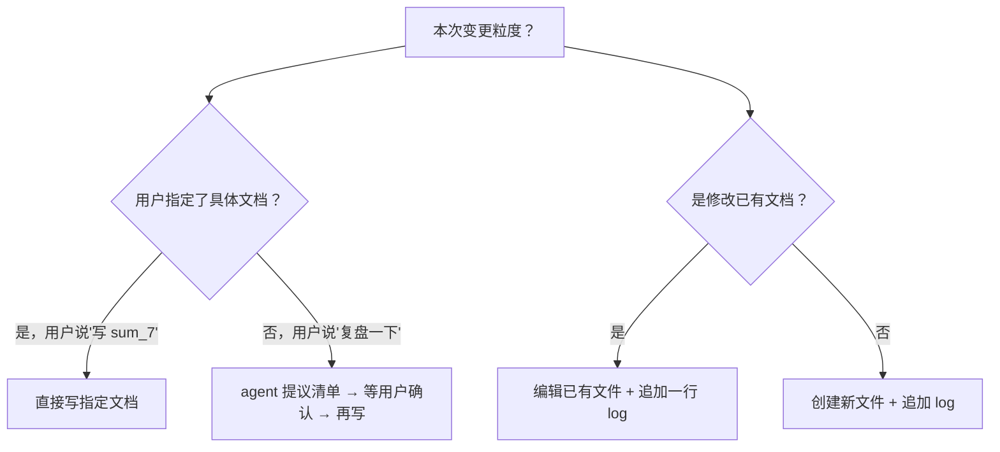

# Agent Memory — 项目文档体系总控

## Overview

定义任何项目的标准文档体系，使 AI agent 能在新会话快速重建上下文，
使人类工程师能快速回溯阶段性成果。基于两区制设计：git 内两区并存——
docs/(人类速查) + Reference/(agent 深度认知重建)，均在版本控制下。

**核心权限规则**：Agent 只有提议权，没有写入权。文档的创建、更新、
删除均由用户指定。用户未明确列出的文件，不得修改。

## When to Use

触发词：记录、复盘、写文档、写 sum、写 spec、写 log、初始化项目文档体系、
agent memory、session epilogue、更新 migration_prompt

自动触发场景：
- 会话结束时用户要求"记录下来"或"更新文档"
- 一个 Phase 或子问题闭环后
- 用户说"复盘一下"或"总结当前进展"
- 首次接触一个新项目（初始化文档体系）

## §1 两区制文档体系

```
{git_root}/docs/                       ← 人类工程师面向（全部进 git）
├── logs/        latest_N.log          ← 按时间序的工作日志
├── sums/        sum_N_中文主题.md     ← 阶段性成果精炼
├── specs/       YYYY-MM-DD-主题-design.md ← 重大设计决策单页文档
└── migration_prompt.md                ← 新 agent 会话入口

{git_root}/Reference/                  ← Agent 面向
├── code/                             ← 参考开源代码，每个仓库完整 clone 为独立子目录
├── docs/                             ← 按 Phase 组织的分析文档
│   ├── CONSTITUTION.md               ← 必需：项目硬约束速查
│   ├── INDEX.md                      ← 必需：论文—代码—文档全映射
│   └── PhaseN/                       ← 每个 Phase 固定 3 文件（硬要求）
│       ├── paper_code_summary.md     ← 论文公式→代码位置映射
│       ├── reference_analysis.md     ← 方法偏差对照 + 适配度评估
│       └── guidance.md               ← 实现路径 + 接口约束 + 验收标准
└── sums/                             ← 必需：方法论级别学习记录
    └── sum_N_主题分析.md
```

**核心区分原则**：
- `docs/`（人类区）→ 写"做了什么、结论是什么"——简洁，人一眼看懂。
- `Reference/`（agent 区）→ 写"为什么这么做、学到的教训、决策理由"——详细，agent 重建认知用。

本 skill 只管理上述目录树内的文件。不在上述目录内的文件（如 config.py、
模型代码、测试文件等）不归本 skill 管辖。

## §2 每类文档的创建时机与格式模板

### 2.1 logs/ — 工作日志

**创建时机**：每次重大代码修改、Phase 推进、Bug 修复后。增量追加，不覆盖。

**命名**：`latest_N.log`，N 自增。

**必需内容**：
```
YYYY-MM-DD 概要主题

HH:MM 操作描述
HH:MM 结果/发现
HH:MM 测试状态: N passed
```

### 2.2 docs/sums/ — 阶段性成果精炼（人类面向）

**创建时机**：子问题闭环后。一个 sum 对应一个明确结论，不和 log 重复。

**命名**：`sum_N_中文主题.md`

**必需结构**：问题起点 → 方案与过程 → 关键发现 → 对比（如有演化）→ 下一步

### 2.3 docs/specs/ — 关键设计文档

**创建时机**：架构级决策敲定后。先有决策，再有 spec。

**命名**：`YYYY-MM-DD-{主题}-design.md`

**必需内容**：背景 → 方案（含 Mermaid 架构图）→ 参数表 → 偏差分析 →
接口约束 → 构建状态

### 2.4 Reference/sums/ — 方法论学习记录（Agent 面向）

**创建时机**：深入阅读论文、方法论对比、识别出系统性教训后。

**命名**：`sum_N_主题分析.md`

**必需内容**：顶刊对照表 + 偏差清单（标注"可接受"vs"需修复"）+ design rationale

### 2.5 Reference/docs/PhaseN/ — 三文件模板（硬要求）

每个 Phase 必须包含以下三个文件，不可省略：

#### paper_code_summary.md

论文公式→代码位置映射表。含论文全称、DOI、核心贡献摘要、
关键公式数学表达与代码行号对照。

#### reference_analysis.md

论文方法 vs 项目需求偏差对照表。含开源代码适配度评估
（可直接复用 / 需改造 / 仅思路参考）。

#### guidance.md

实现路径（已完成 + 待迭代）、接口约束、验收标准。

### 2.6 CONSTITUTION.md + INDEX.md（必需）

- **CONSTITUTION.md**：全局参数、接口形状、测试纪律、不可变设计决策。
   每约束一行，含参数名、值、是否可调。
- **INDEX.md**：论文公式→代码文件→行号全映射，Phase→文档路径对应关系。

## §3 migration_prompt.md 标准 5 步结构

固定骨架，内容按实际项目状态填充，结构不可改变：

```
## Step 1: 加载 project-reference skill

## Step 2: 阅读全部关键文档

### 必读（项目状态）
- {列出 docs/specs/ 下所有 .md 完整路径}
- {git 根目录下 PLAN.md 或同等规划文件}

### 必读（决策历史）
- {列出 Reference/sums/ 下所有 .md 完整路径}
- {Reference/docs/CONSTITUTION.md + INDEX.md}

### 速读（了解近期动态）
- docs/logs/ 最新 3 篇

### 必读（代码现状）
- 运行 {TEST_CMD} 获取测试数

## Step 3: 恢复当前任务上下文

### 已完成（按 Phase 分阶段，每阶段一句话）
- Phase 1: {一句话说明}

### 待完成
- {列表}

## Step 4: 硬约束速查（直接遵守）

## Step 5: 回退策略
1. 先读 Reference/docs/PhaseN/ 三文件
2. 再看 Reference/sums/ 对应学习记录
3. 仍不确定 → 直接提问
```

## §4 初始化新项目的 Checklist

新项目 git 根目录下，按序执行：

```
1. 创建 docs/ + 子目录 logs/ sums/ specs/
2. 在 git 根目录下创建 Reference/ + 子目录 code/ docs/ sums/
3. 创建 Reference/docs/CONSTITUTION.md（占位）
4. 创建 Reference/docs/INDEX.md（空框架）
5. 创建 docs/migration_prompt.md（按 §3 模板写骨架，内容标 TODO）
6. 创建 docs/logs/latest_0.log（首条记录："项目启动"）
7. 提示用户 Reference/ 位于 git 根目录内，随 Code/ 一同 version control
```

每当新建 Phase：
```
1. 在 Reference/docs/ 下创建 PhaseN/ + 三文件（占位 + 逐步填充）
2. 更新 INDEX.md
3. 更新 migration_prompt.md 的 Step 2-3
```

## §5 会话收尾工作流

```
1. 加载 project-reference skill → 了解当前项目状态
2. 扫描 docs/logs/ → 确定最新 log 编号 N
3. 判断本次变更粒度（见下方决策流程图），向用户提议应创建/更新哪些文档
4. ⚠️ 等待用户确认文档清单，不自行决定
5. 用户确认后，按 §2 对应模板撰写
6. 如有新文档路径加入 → 更新 migration_prompt.md Step 2
7. 如有 Phase 切换 → 更新 migration_prompt.md Step 3
8. 加载 verification-before-completion → 确认文档已写入、非空
```

**决策流程图**：



## §6 可调用的辅助 Skill

| 场合 | Skill | 用途 |
|------|------|------|
| 撰写任何 .md 文档 | `markdown-mermaid-writing` | Markdown 格式 + Mermaid 图表 |
| 写 Reference/sums/ 方法论文档 | `scientific-critical-thinking` | 方法论评价、偏差分析 |
| 写 specs 设计文档 | `markdown-mermaid-writing` | 架构图 + 参数表 |
| 写 Reference/docs/PhaseN/ 三文件 | `paper-lookup` | 论文全称、DOI 验证 |
| 文档写完收尾 | `verification-before-completion` | 文件非空、格式完整 |
| 每次会话开始 | `project-reference` | 重建项目上下文 |
| 初始化新项目文档体系 | `project-reference` | 先有项目认知再建文档 |

## §7 参考示例

本 skill 来源项目：
`E:\快捷事项\科研-竞赛 Practice\创新项目5.15\`

截至 2026-07-12，其文档体系完整落地了两区制设计：
- `docs/logs/` — 13 篇，latest_0 ~ latest_11
- `docs/sums/` — 6 篇总结
- `docs/specs/` — 3 篇设计文档
- `docs/migration_prompt.md` — 5 步标准结构
- `Reference/code/` — nrf / VPRSNN / noise2image，完整 clone
- `Reference/docs/Phase1~5` — 每 Phase 三文件
- `Reference/docs/CONSTITUTION.md` — 36 条硬约束
- `Reference/docs/INDEX.md` — 全映射
- `Reference/sums/` — 12 篇方法论记录

## Common Mistakes

| 错误 | 纠正 |
|------|------|
| 每改一行代码就写 sum | sum 是子问题闭环后才写，不是每次 commit 都写 |
| spec 比代码先写 | spec 是设计决策敲定后的记录，不是编码前的计划 |
| 写了 spec 不更新 migration_prompt | 新文档路径必须加入 migration_prompt Step 2 |
| 忘记写 log | 哪怕只改 3 行，只要是一个独立操作就写一行 log |
| 用纯中文写 Reference 标题 | 保持论文名/方法名原文 + 中文副标题 |
| 越权自行创建文档 | 只提议，等用户确认后再写 |

## Red Flags

- "太简单了，不需要记录" → 简单的事忘了最亏。写一行 log。
- "之后再来补 spec" → 不会补。现在就写。
- "log/sum/spec 太多了，agent 不用全读" → migration_prompt Step 2 就是设计来全读的。
- "攒着等 Phase 结束一起写" → 细节忘光。每次写。
