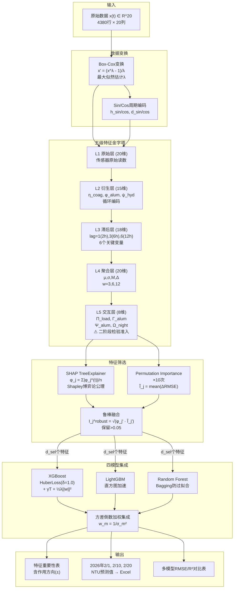
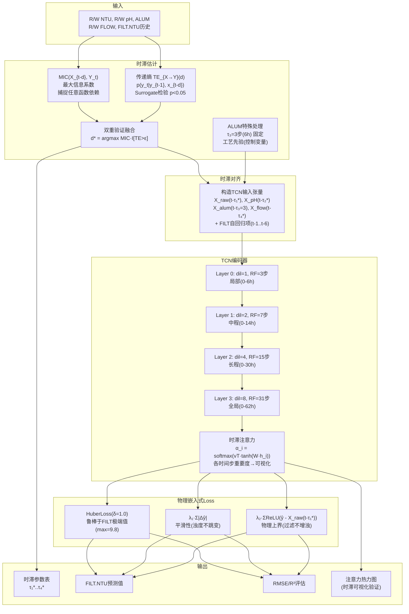
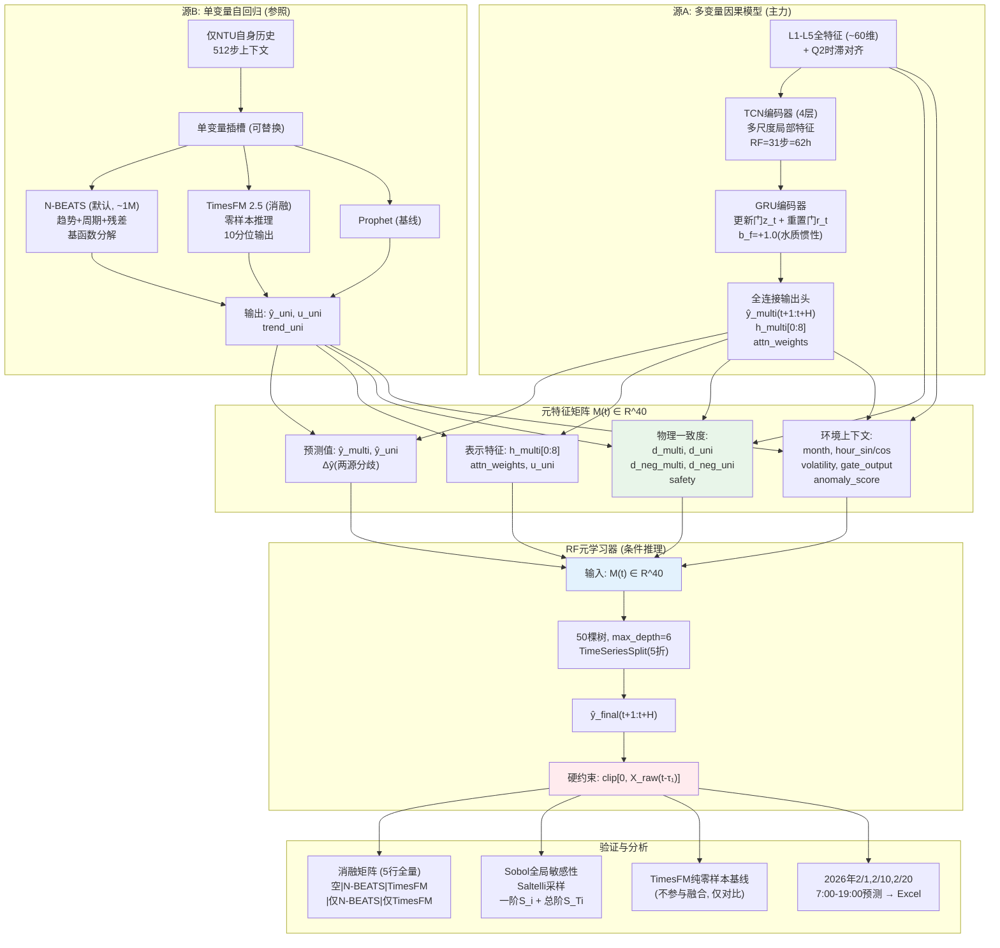
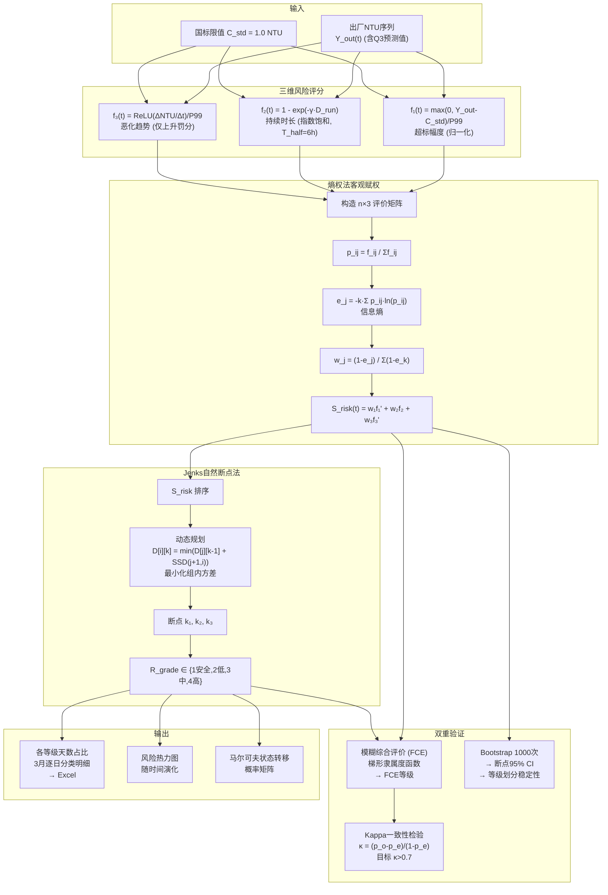
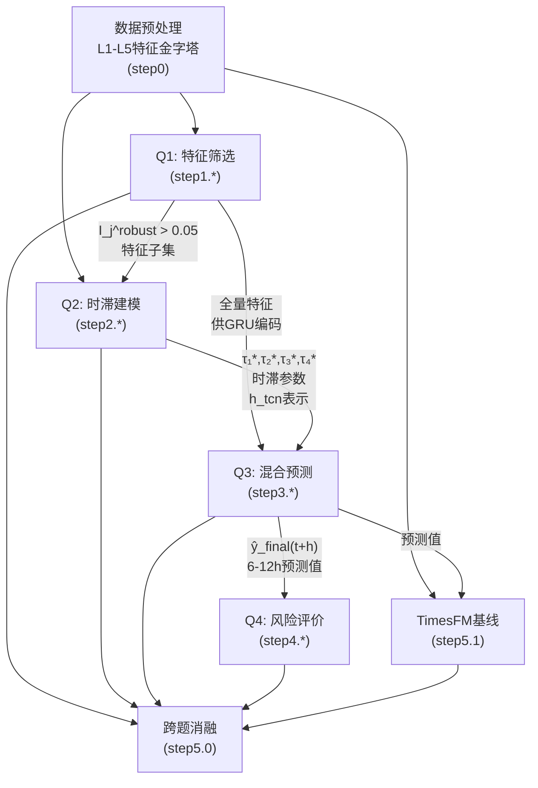
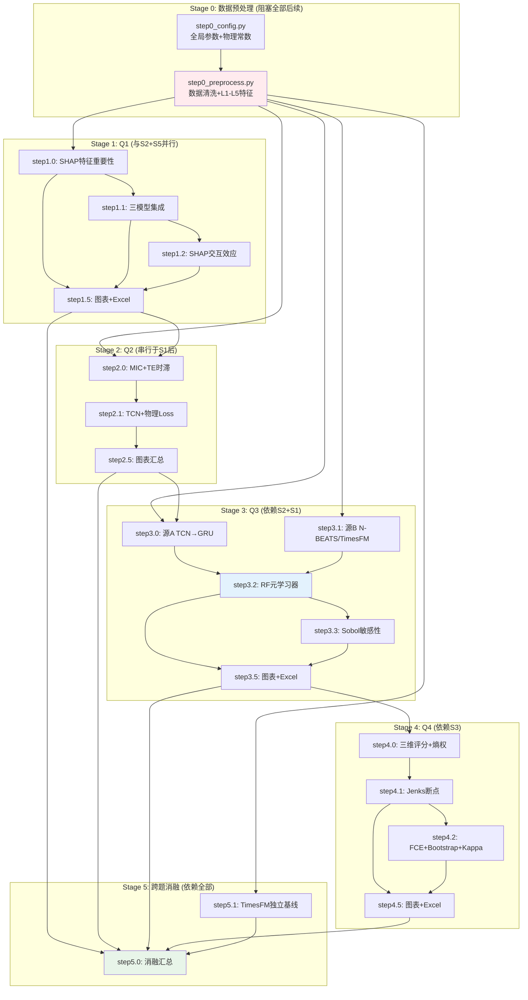

## meta
- document: PLAN-details.md
- status: approved
- version: 1.0
- last_updated: 2026-07-23 22:30
- project: CUMCM 2026 B题 自来水厂水质预测与评估
- team: Python编程, MathorCup 国二保底
- target: 国家一等奖, 冲刺国家特等奖

# CUMCM 2026 B题 — 完整数学模型详细实施方案

---

## 目录

1. [项目概览与全局符号表](#1-项目概览与全局符号表)
2. [Q1: 特征筛选与出厂浊度预测模型](#2-q1-特征筛选与出厂浊度预测模型)
3. [Q2: 滤后水浊度动态时滞模型](#3-q2-滤后水浊度动态时滞模型)
4. [Q3: 出厂水浊度6-12h混合预测模型](#4-q3-出厂水浊度6-12h混合预测模型)
5. [Q4: 水质风险四等级评价模型](#5-q4-水质风险四等级评价模型)
6. [跨题依赖关系与统一Loss设计](#6-跨题依赖关系与统一loss设计)
7. [附录A: 全局参数表](#附录a-全局参数表)
8. [附录B: 五级特征金字塔完整定义](#附录b-五级特征金字塔完整定义)
9. [附录C: 文件命名规范(math-name)](#附录c-文件命名规范math-name)
10. [附录D: 消融实验矩阵完整设计](#附录d-消融实验矩阵完整设计)
11. [附录E: 全题依赖关系DAG](#附录e-全题依赖关系dag)

---

## 1. 项目概览与全局符号表

### 1.1 题目简述

某自来水厂连续15个月运行监测数据（2025年全年12个月 + 2026年1-3月），每天记录12次（每2小时一次），包含原水水质、工艺过程参数、出厂水质及设备运行状态共约20个变量。本研究需通过建立数学模型解决4个递进问题：特征筛选与预测(Q1)、滤后水动态时滞建模(Q2)、出厂水6-12h混合预测(Q3)、水质风险四等级评价(Q4)。

**数据规模**: 2025年4380行(训练), 2026年36行(测试)。NTU自相关 lag1=0.88, 极右偏(skew=3.24~7.80), 超标率3.9%, 7-9月为高浊度季。

### 1.2 小问速览

| 小问 | 核心目标 | 题型 | 输入 | 输出 |
|------|---------|------|------|------|
| Q1 | 筛选NTU主因, 建模预测3天NTU | 预测类(回归) + 特征选择 | 2025年4380行全特征 | 特征重要性排序, 2026年2/1,2/10,2/20 NTU预测 |
| Q2 | 建立FILT.NTU动态模型, 估计各输入时滞参数 | 机理分析类 + 预测类(时序) | 原水指标+操作变量+FILT历史 | 时滞参数τ*, FILT.NTU预测, RMSE/R² |
| Q3 | 6-12h出厂NTU混合预测 + 敏感性分析 | 预测类(时序) + 机理分析类 | 全特征+Q2时滞+Q1特征集 | 2026年3天7:00-19:00逐小时NTU, Sobol报告 |
| Q4 | 四等级风险评价 | 评价类(指标体系) + 分类 | Q3预测值 + 国标限值 | 各等级天数占比, 3月逐日分类明细 |

### 1.3 全局符号表

| 符号 | 含义 | 类型 | 单位 | 约束范围 | 来源 |
|------|------|:---:|------|-----------|------|
| $t$ | 离散时间步索引 | 索引 | 步 | $t\in[1, 4380]$ | 采样定义 |
| $\Delta t$ | 采样间隔 | 常量 | h | 固定值2h | 题目给定 |
| $H$ | 预测视界 | 参数 | 步 | $H\in\{3,6\}$ (6h/12h) | Q3定义 |
| $X_{raw}(t)$ | 原水浊度 R/W NTU | 决策变量(输入) | NTU | [2, 456] | 传感器 |
| $X_{flow}(t)$ | 原水流量 R/W FLOW | 决策变量(输入) | m³/h | [4.7, 63.4] | 传感器 |
| $X_{alum}(t)$ | 矾投加量 ALUM | 决策变量(操作) | mg/L | [0.04, 0.08] | 传感器 |
| $X_{pH}(t)$ | 原水pH R/W PH | 决策变量(输入) | — | {7.0, 7.1, 7.3} | 传感器 |
| $Y_{filt}(t)$ | 滤后水浊度 FILT.NTU | 中间变量 | NTU | [0.02, 9.8] | 传感器(Q2目标) |
| $Y_{out}(t)$ | 出厂水浊度 NTU | 目标变量 | NTU | [0.08, 11.9] | 传感器(Q1/Q3目标) |
| $L_{cw}(t)$ | 清水池水位 C/W WELL LEVEL | 状态变量 | m | [2.5, 4.5] | 传感器 |
| $Q_{out}(t)$ | 出厂流量 T/W FLOW | 状态变量 | m³/h | [30, 55] | 传感器 |
| $\tau_{coag}$ | 混凝反应时滞 | 中间参数 | h | 待估计 | Q2推导 |
| $\tau_{cstr}$ | 清水池平均停留时间 | 中间参数 | h | $L_{cw}\cdot A/Q_{out}$ | Q3推导 |
| $N_{cstr}$ | CSTR串联级数 | 中间参数 | — | [2, 10] | Q3推导 |
| $C_{std}$ | 国标浊度限值 | 常量 | NTU | 固定值 1.0 | 题目给定 |
| $\eta_{coag}(t)$ | 混凝去除效率 | 中间变量(衍生) | % | $\approx$ 99.1-99.3% | L2特征 |
| $S_{risk}(t)$ | 三维风险评分 | 评价变量 | — | [0, 1] | Q4定义 |
| $R_{grade}(t)$ | 风险等级 | 分类变量 | 离散 | $\{1,2,3,4\}$ | Q4定义 |
| $h_t$ | GRU隐藏状态 | 模型内部变量 | — | $\mathbb{R}^{64}$ | Q3模型 |
| $\mathbf{M}(t)$ | 元特征矩阵 | 模型内部变量 | — | $\mathbb{R}^{40}$ | Q3融合 |

---

## 2. Q1: 特征筛选与出厂浊度预测模型

### 2.1 变量定义表

| 符号 | 变量名 | 类型 | 单位 | 约束/范围 | 说明 |
|------|--------|:---:|------|-----------|------|
| $\mathbf{x}^{(t)}$ | 原始特征向量 | 输入 | 混合 | $\mathbb{R}^{20}$ | t时刻20维传感器读数 |
| $\mathbf{x}'^{(t)}$ | 变换后特征向量 | 中间变量 | 混合 | $\mathbb{R}^{60}$ | L1-L5五级金字塔输出 |
| $\phi_j$ | SHAP特征重要性 | 中间变量 | — | $\mathbb{R}_{\ge 0}$ | 特征j的Shapley值均值 |
| $\tilde{I}_j$ | Permutation重要性 | 中间变量 | — | $\mathbb{R}_{\ge 0}$ | 特征j的打乱后性能下降 |
| $I_j^{robust}$ | 鲁棒融合重要性 | 中间变量 | — | [0, 1] | 双重验证的几何平均 |
| $\hat{y}_{out}(t)$ | 出厂浊度预测值 | 输出(预测) | NTU | [0, 11.9] | Q1模型输出 |
| $y_{out}(t)$ | 出厂浊度真实值 | 目标变量 | NTU | [0.08, 11.9] | 传感器标签 |
| $M$ | XGBoost树的数量 | 超参 | 棵 | {100, 200, 300} | XGBoost n_estimators |
| $T$ | 单树叶节点数 | 内部变量 | 个 | 自动确定 | XGBoost正则项 |
| $w$ | 叶节点权重向量 | 内部变量 | — | 待学习 | XGBoost参数 |

### 2.2 核心假设

| H# | 假设 | 合理性论证 |
|:---:|------|------|
| **Q1-H1** | 浊度服从指数衰减/增长规律，经Box-Cox变换后可用线性可加模型近似 | 数据验证：R/W NTU(skew=3.24)、NTU(skew=6.92)、FILT.NTU(skew=7.80)均极右偏。Box-Cox通过最大似然估计自动选取最优λ，将分布趋近对称(物理依据：水质浓度在低值附近聚集，高值为小概率事件，符合环境系统的统计规律) |
| **Q1-H2** | 不同时间步的样本可视为独立同分布（用于特征筛选阶段），忽略2h间隔内的细微时序依赖 | 简化特征筛选的计算复杂度。严格时序依赖在Q2/Q3的专门时序模型中处理。在Q1中我们关注"哪些变量在任何时刻对NTU有解释力"，而非"变量如何随时间传播影响" |
| **Q1-H3** | 2025年的统计规律可外推到2026年——水厂的工艺参数、运行策略、季节模式在两年间保持稳定 | 题目明确2025年数据用于建模、2026年数据用于预测。这是所有预测模型的基础前提。如果存在概念漂移（如设备老化），其影响在RMSE中自然体现 |

### 2.3 公式推导

#### 2.3.1 数据变换: Box-Cox

对原始特征 $x_j$（极右偏），通过最大似然估计选取变换参数 $\lambda$：

$$x_j' = \begin{cases} \dfrac{x_j^\lambda - 1}{\lambda}, & \lambda \neq 0 \\[8pt] \ln(x_j), & \lambda = 0 \end{cases}$$

> **物理意义**: 式(1)将右偏的浊度分布趋近正态。$\lambda \approx 0$ 时近似对数变换——对应水质浓度在稀释/浓缩过程中遵循指数律：$C(t)=C_0 e^{-kt}$，取对数后 $-\ln C = kt - \ln C_0$ 变为线性关系。

**λ的选择标准**: 最大化以下对数似然函数（对每个特征独立估计）：

$$\ell(\lambda) = -\frac{n}{2}\ln\left[\frac{1}{n}\sum_{i=1}^{n}(x_i'(\lambda) - \overline{x'}(\lambda))^2\right] + (\lambda-1)\sum_{i=1}^{n}\ln x_i$$

> **物理意义**: 式(2)在"数据正态化"(第一项, 最小化方差)和"保持原始尺度"(第二项, Jacobian校正)之间寻找最优平衡。

#### 2.3.2 五级特征金字塔(L1-L5)

**L1 原始特征层(20维)** — 直接传感器读数，无变换：

$$\mathbf{x}_{L1}^{(t)} = [X_{raw}(t), X_{flow}(t), X_{alum}(t), X_{pH}(t), Y_{filt}(t), Y_{out}(t-1), ...] \in \mathbb{R}^{20}$$

**L2 衍生特征层(15维)** — 基于物理守恒律的运算：

**(a) 混凝去除效率** $\eta_{coag}$ — 质量守恒: 进入系统的浊度=被去除的+残留的

$$\eta_{coag}(t) = \frac{X_{raw}(t) - Y_{filt}(t)}{X_{raw}(t) + \epsilon}, \quad \epsilon = 10^{-6}$$

> **物理意义**: 式(3)是混凝-沉淀-过滤联合单元的质量守恒表达。分子为被去除的浊度($\Delta\text{NTU}$)，分母为进入系统的总浊度。$\epsilon$防止除零。数据中$\eta_{coag}$约99.1%-99.3%，波动反映工艺效率变化。

**(b) 单位矾耗** $\phi_{alum}$ — 经济性指标：

$$\phi_{alum}(t) = \frac{X_{alum}(t)}{X_{raw}(t) + \epsilon}$$

> **物理意义**: 式(4)表示每单位原水浊度消耗的矾量。$\phi_{alum}$增加→矾相对过量；$\phi_{alum}$降低→矾可能不足。本质是混凝剂投加量与原水负荷的匹配度。

**(c) 水力负荷率** $\psi_{hyd}$ — 单位滤池面积处理量：

$$\psi_{hyd}(t) = \frac{X_{flow}(t)}{A_{filter}}$$

> **物理意义**: 式(5)中$A_{filter}$为滤池面积常数(可归一化)。流量增大→水力负荷增大→过滤接触时间缩短→可能降低过滤效率。这是水处理工程中的标准无量纲量。

**(d) 时间周期编码**:

$$h_{sin}^{(t)} = \sin\left(\frac{2\pi \cdot h(t)}{24}\right), \quad h_{cos}^{(t)} = \cos\left(\frac{2\pi \cdot h(t)}{24}\right)$$

$$d_{sin}^{(t)} = \sin\left(\frac{2\pi \cdot d(t)}{365}\right), \quad d_{cos}^{(t)} = \cos\left(\frac{2\pi \cdot d(t)}{365}\right)$$

> **物理意义**: 式(6)-(7)将小时(0→23)和年内天数(1→365)映射到单位圆上，保证23:00和00:00在特征空间中相邻（循环连续性），避免了直接用整数编码导致的"午夜边界断层"问题。

**L3 滞后特征层(18维)** — 因果链的时域展开：

$$\forall j \in \mathcal{J}_{key},\ \forall k \in \mathcal{L}=\{1,3,6\}: \quad x_j^{(t-k)}$$

其中 $\mathcal{J}_{key} = \{\text{R/W NTU}, \text{R/W FLOW}, \text{ALUM}, \text{FILT.NTU}, \text{NTU}, \text{R/W PH}\}$。

> **物理意义**: 式(8)中lag=1(2h)、lag=3(6h)、lag=6(12h)的选择基于水处理工艺的物理停留时间: 矾反应~30min, 沉淀~2h, 过滤~30min, 清水池混合~4-8h。$k=1$捕捉过滤的短期记忆, $k=3$覆盖全链条(混凝-沉淀-过滤), $k=6$捕捉清水池混合+缓冲效应。

**L4 聚合特征层(20维)** — 趋势与波动性：

$$\mu_{j,w}^{(t)} = \frac{1}{w}\sum_{i=0}^{w-1} x_j^{(t-i)}, \quad w \in \{3,6,12\}$$

$$\sigma_{j,w}^{(t)} = \sqrt{\frac{1}{w-1}\sum_{i=0}^{w-1}(x_j^{(t-i)} - \mu_{j,w}^{(t)})^2}$$

$$M_{j,w}^{(t)} = \max_{i=0}^{w-1} x_j^{(t-i)}$$

$$\Delta_{j}^{(t)} = x_j^{(t)} - x_j^{(t-1)}$$

> **物理意义**: 式(9)均值$\mu$代表近期趋势——6h均值升高→水质恶化趋势。式(10)标准差$\sigma$代表波动性——暴雨来袭时原水浊度$\sigma$急剧上升。式(11)峰值$M$是记忆效应——系统是否有过冲击。式(12)变化率$\Delta$是瞬时恶化/改善信号。窗口大小$w\in\{3,6,12\}$对应6h(一个班次)、12h(半个工作日)、24h(日周期)。

**L5 交互特征层(8维)** — 物理量乘积（仅选有物理意义的组合）：

**(a) 污染物总通量** $\Pi_{load}$ — 质量守恒: 载荷=浓度×流量

$$\Pi_{load}(t) = X_{raw}(t) \cdot X_{flow}(t)$$

> **物理意义**: 式(13)表示单位时间进入水处理系统的浊度总量(NTU·m³/h)。物理类比: 污染物总通量 = 浓度 × 体积流量。单独看浓度(很高但流量低→总负荷不大)或流量(很大但原水清→总负荷不大)都不够，乘积才反映系统承受的真实处理压力。

**(b) 混凝剂相对充足度** $\Gamma_{alum}$:

$$\Gamma_{alum}(t) = \frac{X_{alum}(t)}{X_{raw}(t) + \epsilon}$$

> **物理意义**: 式(14)与前文的$\phi_{alum}$等价。保留在此作为L5是因为它与L3滞后特征构成交互上下文——"6h前的矾充足度×当前的浊度变化"才构成有意义的非线性组合。

**(c) 总药剂投加速率** $\Psi_{alum}$:

$$\Psi_{alum}(t) = X_{alum}(t) \cdot X_{flow}(t)$$

> **物理意义**: 式(15)是单位时间投入系统的矾总量(mg·m³/L·h)。与$\Pi_{load}$配对可构建"污染物负荷vs药剂投入"的匹配程度指标。

**(d) 夜间突变检测** $\Omega_{night}$:

$$\Omega_{night}(t) = \Delta_{R/W NTU}^{(t)} \cdot \mathbb{I}[h(t) \in \{22,23,0,1,2,3,4,5,6\}]$$

> **物理意义**: 式(16)检测夜间(22:00-06:00)原水浊度的突增。夜班操作人员少、响应速度慢，夜间突发高浊度的危害更大。指示函数$\mathbb{I}[\cdot]$仅在夜间时段激活。

#### 2.3.3 SHAP特征重要性

使用XGBoost作为基模型训练回归器 $f$，计算每个特征 $j$ 在样本 $t$ 上的Shapley值：

$$\phi_j^{(t)} = \sum_{S \subseteq \mathcal{J}\setminus\{j\}} \frac{|S|!(|\mathcal{J}|-|S|-1)!}{|\mathcal{J}|!} \left[f(S \cup \{j\}; x^{(t)}) - f(S; x^{(t)})\right]$$

> **物理意义**: 式(17)的核心是Shapley值的"公平分配"公理——将每次预测偏离基线的量公平地分配给所有特征。$\phi_j^{(t)} > 0$表示特征$j$在这次预测中将NTU推高了$\phi_j^{(t)}$个单位；$\phi_j^{(t)} < 0$表示推低了。Shapley公理保证: ①效率性——所有特征贡献之和=预测值-基准值；②对称性——功能相同的特征获得相同值；③虚拟性——从未影响输出的特征获得零值；④可加性——联合模型贡献=各自贡献之和。

全局特征重要性取SHAP绝对值均值（因为方向不重要，重要的是影响大小）：

$$\phi_j = \frac{1}{|\mathcal{D}|}\sum_{t \in \mathcal{D}} |\phi_j^{(t)}|$$

#### 2.3.4 Permutation Importance双重验证

打乱特征$j$的取值，重新评估模型性能下降：

$$\tilde{I}_j = \frac{1}{K}\sum_{k=1}^{K} \left(E_{base} - E_{permuted}^{(j,k)}\right)$$

> **物理意义**: 式(19)通过人为破坏特征$j$的信息来度量其对模型预测的贡献。$E$为RMSE，$K=10$次随机排列取均值。Permutation的独特价值在于: 它不依赖模型内部结构（SHAP依赖模型），可以检测"特征间存在共线性时SHAP可能高估"的问题。

**鲁棒融合** (取几何平均以惩罚两种方法分歧大的特征):

$$I_j^{robust} = \frac{\phi_j}{\max_j \phi_j} \cdot \frac{\tilde{I}_j}{\max_j \tilde{I}_j}$$

> **物理意义**: 式(20)的几何平均设计确保只有当SHAP和Permutation都认为特征重要时，$I_j^{robust}$才高。如果一种方法认为重要而另一种不认为，乘积会抑制该特征。这是对单一重要性指标的"交叉验证"。

保留 $I_j^{robust} > \theta = 0.05$ 的特征进入后续模型。$\theta=0.05$的选择平衡了信息保留与噪声过滤。

#### 2.3.5 XGBoost模型目标函数

XGBoost通过串行添加决策树来拟合残差。第$m$轮的目标函数：

$$\mathcal{L}^{(m)} = \sum_{t=1}^{n} \ell(y^{(t)}, \hat{y}^{(t,m-1)} + h_m(x^{(t)})) + \gamma T + \frac{1}{2}\lambda \|w\|^2$$

> **物理意义**: 式(21)包含三部分——(a)预测损失$\ell$（我们使用Huber Loss，见下），(b)树复杂度惩罚$\gamma T$（$\gamma$控制每增加一片叶的代价，防止过拟合），(c)L2正则化$\frac{1}{2}\lambda\|w\|^2$（防止任何单一叶节点权重过大）。对于极右偏的浊度数据，Huber Loss替代标准MSE：

$$\ell_{huber}(r) = \begin{cases} \frac{1}{2}r^2, & |r| \le \delta \\ \delta(|r| - \frac{1}{2}\delta), & |r| > \delta \end{cases}$$

> **物理意义**: 式(22)中$\delta=1.0$。当预测误差$|r|<\delta$时使用MSE（对小误差精确拟合），当$|r|\ge\delta$时使用MAE（对大误差线性惩罚，不被极端值(NTU max=11.9)主导梯度）。这相当于在NTU正常波动范围内精确拟合，在超标事件上不过度受个别极端值影响。

#### 2.3.6 三模型方差倒数加权集成

三个独立模型的预测值通过方差的倒数加权平均：

$$\hat{y}_{ens}(x) = \frac{\sum_{m=1}^{3} w_m \cdot \hat{y}^{(m)}(x)}{\sum_{m=1}^{3} w_m}, \quad w_m = \frac{1}{\sigma_m^2}$$

> **物理意义**: 式(23)的核心直觉——$\sigma_m^2$是模型$m$在5折交叉验证中的预测方差。方差大的模型不可靠→获得小权重$w_m$；方差小的模型稳定→获得大权重。这比简单等权平均更优雅，因为避免了"用一个总是出错的模型去平均一个总是准确的模型"导致的精度退化。

---

### 2.4 Q1建模流程图



**关键决策点标注**:
- Box-Cox λ: 通过最大似然自动选取, 避免人为猜测
- L5交互特征: 二阶段检验(物理合理性 + SHAP Interaction显著性), 任一不过→删除
- $I_j^{robust}>0.05$: 阈值基于预实验, 若保留特征过多/过少可在编码时调整

---

## 3. Q2: 滤后水浊度动态时滞模型

### 3.1 变量定义表

| 符号 | 变量名 | 类型 | 单位 | 约束/范围 | 说明 |
|------|--------|:---:|------|-----------|------|
| $\tau_1$ | R/W NTU→FILT的最优时滞 | 决策参数 | 步 | $\{0,1,...,6\}$ | 传递熵+MCI估计 |
| $\tau_2$ | R/W pH→FILT的最优时滞 | 决策参数 | 步 | $\{0,1,...,6\}$ | 同上 |
| $\tau_3$ | ALUM→FILT的最优时滞 | 固定参数 | 步 | 固定值3(6h) | 工艺先验(控制变量) |
| $\tau_4$ | R/W FLOW→FILT的最优时滞 | 决策参数 | 步 | $\{0,1,...,6\}$ | 传递熵+MCI估计 |
| $k$ | TCN卷积核大小 | 架构参数 | — | 3 | 固定 |
| $L$ | TCN层数 | 架构参数 | 层 | 4 | 固定 |
| $s_l$ | 第$l$层膨胀因子 | 架构参数 | — | $2^l$ | 指数扩张 |
| $RF$ | 感受野 | 推导参数 | 步 | $1+2(2^L-1)=31$步=62h | 覆盖最长时滞 |
| $h_t^{(l)}$ | 第$l$层t时刻的隐状态 | 内部变量 | — | $\mathbb{R}^{64}$ | 卷积输出 |
| $\alpha_i$ | 时滞注意力权重 | 内部变量 | — | [0,1], $\Sigma\alpha_i=1$ | 各时间步重要度 |
| $\hat{y}_{filt}(t)$ | FILT.NTU预测值 | 输出(预测) | NTU | [0, 9.8] | Q2模型输出 |
| $y_{filt}(t)$ | FILT.NTU真实值 | 目标变量 | NTU | [0.02, 9.8] | 传感器标签 |
| $MIC_{X,Y}(d)$ | 最大信息系数 | 中间变量 | — | [0, 1] | 非线性统计依赖 |
| $TE_{X\to Y}(d)$ | 传递熵 | 中间变量 | bits | $\mathbb{R}_{\ge 0}$ | 因果方向性 |

### 3.2 核心假设

| H# | 假设 | 合理性论证 |
|:---:|------|------|
| **Q2-H1** | 混凝-沉淀-过滤链条可近似为具有固定传输延迟的因果系统(各输入→输出的时滞$\tau_i$在统计意义上稳定) | 物理依据: 矾反应动力学~30min, 沉淀沉降~2h, 过滤接触~30min, 总延迟约3-6h且由设备尺寸和流速决定(非时变)。数据验证: R/W NTU(t-d)→FILT(t)的Spearman相关在d=0→6间单调递减(r从0.154→0.132, 衰减缓慢但持续), 支持短时滞假设 |
| **Q2-H2** | ALUM的时滞无法可靠地通过统计数据估计, 需采用工艺先验固定值 | 数据事实: ALUM→FILT的所有lag上Pearson相关≈0(最大r=0.006)。这是控制变量的典型特征——操作员根据当前R/W NTU主动调节矾量, 因此矾量与滤后浊度的原始相关被控制逻辑"抹平"。传递熵在此场景下同样失效(因果已被人为切断)。故取工程先验: 矾反应~30min + 沉淀~2h → τ₃≈6h=3步 |
| **Q2-H3** | 过滤过程满足物理单调性: 滤后浊度 $\le$ 对应时刻(时滞对齐后)的原水浊度 | 数据验证: 在4379个有效样本中FILT>R/W的违规次数为0。这是由过滤的物理本质决定的——物理截留只能降低不能增加悬浮物浓度。该约束通过Loss中的ReLU惩罚项嵌入模型训练 |

### 3.3 公式推导

#### 3.3.1 最大信息系数(MIC) — 非线性统计依赖度量

对候选时滞$d$，在变量$X$的$d$步滞后与$Y$当前值之间计算MIC。首先将散点图划分为$n_X \times n_Y$的网格，互信息：

$$I(X_{t-d}; Y_t) = \sum_{i=1}^{n_X}\sum_{j=1}^{n_Y} p(i,j) \log_2 \frac{p(i,j)}{p(i) p(j)}$$

> **物理意义**: 式(24)是信息论中度量两个变量共享信息量的标准公式。$p(i,j)$是联合分布，$p(i)p(j)$是独立假设下的期望联合分布。$I=0$表示完全独立，$I$越大表示共享信息越多。与Pearson相关的关键区别：$I$不假设线性关系——它捕捉$X$和$Y$之间的任意函数依赖。

在多种网格划分方案中取最大值归一化：

$$MIC(X_{t-d}; Y_t) = \max_{n_X \cdot n_Y < B} \frac{I(X_{t-d}; Y_t)}{\log_2 \min(n_X, n_Y)}$$

> **物理意义**: 式(25)中$B = n^{0.6}$(Reshef et al. 2011)限制了网格总数，防止过度精细的网格导致$I=1$（过拟合到噪声）。除以$\log_2\min(n_X,n_Y)$是对网格复杂度的惩罚——网格越细，互信息越容易变大，但除以log项后使得不同网格划分方案的MIC可比。MIC∈[0,1]，1表示完美的任意函数依赖。

#### 3.3.2 传递熵(TE) — 因果方向性检测

传递熵度量$X$的过去是否提供了$Y$未来的信息（在$Y$自身过去已知的前提下）：

$$TE_{X \to Y}(d) = \sum_{y_t, y_{t-1}, x_{t-d}} p(y_t, y_{t-1}, x_{t-d}) \cdot \log_2 \frac{p(y_t \mid y_{t-1}, x_{t-d})}{p(y_t \mid y_{t-1})}$$

> **物理意义**: 式(26)的核心直觉——分母$p(y_t|y_{t-1})$是"只知$Y$自身历史时，预测$Y_t$的不确定性"；分子$p(y_t|y_{t-1}, x_{t-d})$是"额外知道$X$在$d$步前的值时，预测$Y_t$的不确定性"。如果比值>1（取log后>0），说明$X$提供了额外的预测信息→$X$对$Y$有因果影响。TE的关键特性：它是**非对称的**——$TE_{X\to Y} \neq TE_{Y\to X}$——这使其能判断因果方向。

**显著性检验**(Surrogate Test): 对$X_{t-d}$随机打乱1000次，计算打乱后的TE分布作为零假设。仅当原始TE > 第95分位时接受TE显著：

$$\tau^*_{TE} = \arg\max_{d \in [0, 6]} \left\{ TE(d) \cdot \mathbb{I}[TE(d) > TE_{shuffle}^{p95}] \right\}$$

#### 3.3.3 MIC+TE双重验证融合

$$d_i^* = \arg\max_{d \in [0, 6]} \left( MIC(d) \cdot \mathbb{I}[TE(d) > \epsilon_{TE}] \right)$$

> **物理意义**: 式(28)不仅取MIC最大(统计相关性最强的lag)，还要求TE通过显著性检验(确认方向性和因果性)。对R/W NTU和R/W FLOW使用此方法。对ALUM，由于Q2-H2，固定$\tau_3^* = 3$步(6h)。

#### 3.3.4 TCN因果膨胀卷积

**因果填充**: 对时间$t$的卷积操作仅使用$t$及之前时间步的信息（确保预测不泄露未来信息）。填充方式为左侧填充pad_size个零：

$$pad = (kernel\_size - 1) \times dilation$$

**第$l$层膨胀卷积** (膨胀因子$s_l = 2^l$):

$$h_t^{(l)} = \text{ReLU}\left(\sum_{i=0}^{k-1} W_i^{(l)} \cdot h_{t - s_l \cdot i}^{(l-1)} + b^{(l)}\right)$$

> **物理意义**: 式(29)中$k=3$为卷积核大小（每次看3个时间点），$s_l=2^l$为膨胀因子（每层的步长翻倍）。第0层($s=1$)看相邻点→捕捉2h级变化；第1层($s=2$)看每隔1个点→捕捉4h级变化；第3层($s=8$)看每隔8个点→捕捉16h级变化。**感受野**: $RF = 1 + (k-1) \times \sum_{l=0}^{L-1} 2^l = 1 + 2 \times (2^L - 1)$。取$L=4$ → $RF=31$步=62h → **完全覆盖最长的12h时滞假设**。

#### 3.3.5 时滞注意力机制

在TCN输出序列上，学习不同时间步对预测目标的重要性：

$$\alpha_i = \frac{\exp(\mathbf{v}^T \tanh(\mathbf{W}_{attn} \cdot h_i^{(L)}))}{\sum_{j=1}^{RF} \exp(\mathbf{v}^T \tanh(\mathbf{W}_{attn} \cdot h_j^{(L)}))}$$

$$\hat{y}_{filt}(t) = \mathbf{W}_{out} \cdot \left(\sum_{i=1}^{RF} \alpha_i \cdot h_i^{(L)}\right) + b_{out}$$

> **物理意义**: 式(30)的$\alpha_i$是可解释的关键产出——它直接显示出"模型在做FILT.NTU预测时，最关注哪个历史时刻的信息"。如果$\alpha_{t-3}$最大→时滞约6h→对应矾反应+沉淀+过滤的物理链条。**这是连接"黑箱深度学习"与"物理工艺理解"的桥梁**——注意力热力图就是滞后参数的视觉验证。

#### 3.3.6 物理嵌入式Loss函数

$$\mathcal{L}_{Q2} = \underbrace{\frac{1}{n}\sum_{t} \rho_\delta(\hat{y}_{filt}(t) - y_{filt}(t))}_{\text{Huber预测损失}} + \lambda_1 \underbrace{\frac{1}{n}\sum_{t} |\hat{y}_{filt}(t) - \hat{y}_{filt}(t-1)|}_{\text{平滑性约束}} + \lambda_2 \underbrace{\frac{1}{n}\sum_{t} \max(0, \hat{y}_{filt}(t) - X_{raw}(t-\tau_1^*))}_{\text{物理上界: 过滤不增浊}}$$

> **物理意义**: 式(32)的三项对应三条物理事实:
> - **Huber**($\delta=1.0$): 对FILT.NTU的极端值(max=9.8)鲁棒。当$|\text{误差}|>1.0$时改用线性惩罚→防止极端事件主导模型更新方向。
> - **平滑项**($\lambda_1=0.1$): 浊度是水质指标，2h内不会跳变。锯齿形预测曲线=物理上不可能。该项强制相邻预测值之间平滑过渡。
> - **物理上界**($\lambda_2=0.5$): 过滤只能降低浊度是铁律。如果模型预测$\hat{y}_{filt}>X_{raw}$→此预测物理无意义→重罚。$\lambda_2=0.5>\lambda_1=0.1$反映物理上界的优先级高于平滑性。

---

### 3.4 Q2建模流程图



---

## 4. Q3: 出厂水浊度6-12h混合预测模型

### 4.1 变量定义表

| 符号 | 变量名 | 类型 | 单位 | 约束/范围 | 说明 |
|------|--------|:---:|------|-----------|------|
| $\hat{y}_{multi}(t+h)$ | 源A多变量预测值 | 中间变量 | NTU | [0, 11.9] | TCN→GRU输出 |
| $\hat{y}_{uni}(t+h)$ | 源B单变量预测值 | 中间变量 | NTU | [0, 11.9] | N-BEATS/TimesFM输出 |
| $h_{multi}^{(t)}$ | GRU最后隐状态 | 中间变量 | — | $\mathbb{R}^{64}$ | 长期记忆表示 |
| $\mathbf{z}_t, \mathbf{r}_t$ | GRU更新门, 重置门 | 内部变量 | — | [0,1]^64 | 门控向量 |
| $\tilde{\mathbf{h}}_t$ | GRU候选隐藏状态 | 内部变量 | — | $\mathbb{R}^{64}$ | 新信息候选 |
| $\mathbf{M}^{(t)}$ | 元特征矩阵 | 融合输入 | — | $\mathbb{R}^{40}$ | RF元学习器输入 |
| $d_{multi}^{(t)}$ | 源A物理违反度 | 元特征 | NTU | $\mathbb{R}_{\ge 0}$ | max(0, ŷ_multi - X_raw) |
| $d_{uni}^{(t)}$ | 源B物理违反度 | 元特征 | NTU | $\mathbb{R}_{\ge 0}$ | max(0, ŷ_uni - X_raw) |
| $\hat{y}_{final}(t+h)$ | 最终预测值 | 输出(预测) | NTU | [0, X_raw(t-τ₁)] | RF元学习器输出 |
| $S_i$ | Sobol一阶效应指数 | 敏感性指标 | — | [0, 1] | 变量i的主效应 |
| $S_{Ti}$ | Sobol总阶效应指数 | 敏感性指标 | — | [0, 1] | 含交互效应 |
| $\theta_k$ | N-BEATS基函数系数 | 可学习参数 | — | 待训练 | 基函数展开权重 |
| $b_k$ | N-BEATS基函数 | 架构组件 | — | 趋势/周期/残差 | 多项式+傅里叶 |

### 4.2 核心假设

| H# | 假设 | 合理性论证 |
|:---:|------|------|
| **Q3-H1** | 清水池可近似为N个等体积连续搅拌釜反应器(CSTR)串联。其停留时间分布(RTD)为$E(\theta)=\frac{N^N\theta^{N-1}e^{-N\theta/\tau}}{\tau^N(N-1)!}$ | 标准化学反应工程假设。有挡板的矩形清水池中的流态介于活塞流(N→∞)和全混流(N=1)之间。$N=10$取为硬边界(保守, 近似活塞流), $N=2$取为参考(充分混合)。论文中讨论对N的灵敏度 |
| **Q3-H2** | 源A(多变量因果模型)和源B(单变量自回归模型)提供的信息在本质上是互补的——A捕捉因果链，B捕捉纯时序模式 | A看60维特征可回答"投矾减半→4h后出水变差"；B仅看NTU历史可回答"按照过去512步走势, 接下来6h通常怎样"。当操作变化时A更可信(B被趋势外推误导)；稳态时B更稳健(A受60维噪声干扰)。互补性通过消融实验定量验证 |
| **Q3-H3** | 出厂浊度不可能高于时滞对齐后的原水浊度: $\hat{y}_{final}(t+h) \le X_{raw}(t+h-\tau_1)$ | 物理守恒律: 水处理只能降低浊度, 不能凭空产生。此约束通过RF输出层的硬裁剪实现——任何超越物理上界的预测值被裁回上界。与Q2的Loss惩罚不同, 此处是硬约束(100%执行) |

### 4.3 公式推导

#### 4.3.1 源A: TCN→GRU集成模型

**TCN**(第一阶段, 多尺度局部特征提取): 同Q2中TCN的架构(式29)。TCN输出一个长度为$T_{in}$的隐状态序列$\{h_{tcn}^{(1)},...,h_{tcn}^{(T_{in})}\}$，其中$T_{in}=48$步(96h)为输入历史窗口。

**GRU**(第二阶段, 长期依赖建模, 在TCN输出的序列上运行):

**(a) 更新门** $\mathbf{z}_t$ — 决定保留多少旧信息 vs 吸收多少新信息:

$$\mathbf{z}_t = \sigma(\mathbf{W}_z \cdot [\mathbf{h}_{t-1}, \mathbf{x}_t^{tcn}] + \mathbf{b}_z)$$

> **物理意义**: $\mathbf{z}_t \in [0,1]^{64}$。每个维度独立决定"该维度上的历史信息应该保留多少"。$\mathbf{z}_t \approx 1$→几乎不更新(系统惯性——稳态运行时水质变化缓慢)；$\mathbf{z}_t \approx 0$→完全替换为新信息(系统突变——暴雨冲击时快速响应)。GRU遗忘门偏置$\mathbf{b}_f$初始化为$+1.0$——反映水质的物理惯性(倾向于"记住"而非"忘记"历史)。

**(b) 重置门** $\mathbf{r}_t$ — 决定在计算候选状态时"遗忘多少历史":

$$\mathbf{r}_t = \sigma(\mathbf{W}_r \cdot [\mathbf{h}_{t-1}, \mathbf{x}_t^{tcn}] + \mathbf{b}_r)$$

**(c) 候选隐藏状态** $\tilde{\mathbf{h}}_t$ — 融合当前输入和(选择性遗忘后的)历史:

$$\tilde{\mathbf{h}}_t = \tanh(\mathbf{W}_h \cdot [\mathbf{r}_t \odot \mathbf{h}_{t-1}, \mathbf{x}_t^{tcn}] + \mathbf{b}_h)$$

**(d) 最终隐藏状态** — 更新门控加权:

$$\mathbf{h}_t = (1 - \mathbf{z}_t) \odot \mathbf{h}_{t-1} + \mathbf{z}_t \odot \tilde{\mathbf{h}}_t$$

> **物理意义**: 式(36)的加权结构——$(1-\mathbf{z}_t)$控制旧信息的保留程度，$\mathbf{z}_t$控制新信息的吸收程度。这是对水处理系统动态的合理建模——系统状态是历史积累的惯性(第一项)和新输入冲击(第二项)的加权组合。TCN→GRU的串联设计让TCN负责"把60维特征聚合为有意义的局部时间模式"，GRU负责"在这些模式上建立长期依赖关系"。

**(e) 输出头** — 多步预测:

$$\hat{y}_{multi}(t+h) = \mathbf{W}_{out} \cdot \mathbf{h}_{T_{in}} + b_{out}, \quad h \in \{1,2,...,H\}$$

#### 4.3.2 源B: N-BEATS单变量自回归模型

N-BEATS将时间序列分解为$K$个基函数的线性组合。第$k$个块产生一对部分预测：

$$\hat{\mathbf{y}}_k = \mathbf{V}_k \cdot \boldsymbol{\theta}_k^f + \mathbf{b}_k^{back}, \quad \hat{\mathbf{x}}_k = \mathbf{V}_k \cdot \boldsymbol{\theta}_k^b + \mathbf{b}_k^{for}$$

$$\boldsymbol{\theta}_k = \text{FC}_k(\mathbf{x} - \sum_{j=1}^{k-1}\hat{\mathbf{x}}_j)$$

> **物理意义**: 式(38)-(39)中$\mathbf{V}_k$是基函数矩阵——当表达趋势时, $\mathbf{V}_k$为多项式基$[1, t, t^2, ..., t^p]$；当表达季节性时, $\mathbf{V}_k$为傅里叶基$[\sin(2\pi t/T), \cos(2\pi t/T), ...]$。N-BEATS学习的是"用哪些基函数、怎样组合来最好地重构NTU序列"。与TimesFM(黑箱, 200M参数)不同, N-BEATS的核心(~1M参数)是可解释的——每个块的输出可以直接画出趋势/周期/残差分量图。**N-BEATS为默认首选, TimesFM仅做消融对比。**

#### 4.3.3 物理子模型: CSTR串联卷积(不作为独立预测输出)

**CSTR串联模型的常微分方程**(质量守恒):

$$\frac{dC_{out}}{dt} = \frac{Q_{in}(t) \cdot C_{in}(t) - Q_{out}(t) \cdot C_{out}(t)}{V(t)}$$

> **物理意义**: 式(40)的含义是"清水池内NTU的变化率 = (流入的NTU总量 - 流出的NTU总量) / 池体积"。$V(t) \propto L_{cw}(t) \cdot A_{cw}$（水位×池横截面积），$C_{in}$近似取同步的$Y_{filt}$值。

**离散化**(欧拉方法, 步长$\Delta t=2$h):

$$C_{out}(t+1) = C_{out}(t) + \frac{\Delta t \cdot \hat{Q}_{out}(t)}{\hat{V}(t)} \cdot (C_{in}(t) - C_{out}(t))$$

令 $\tau_{cstr}(t) = \hat{V}(t) / \hat{Q}_{out}(t)$ 为时变停留时间:

$$C_{out}(t+1) = C_{out}(t) + \frac{\Delta t}{\tau_{cstr}(t)} \cdot (C_{in}(t) - C_{out}(t))$$

> **物理意义**: 式(42)揭示了清水池的平滑机制——$\Delta t / \tau_{cstr}(t)$是每个步长内的"替换比例"。$\tau_{cstr}$大(停留时间长)→替换比例小→$C_{out}$变化缓慢(大缓冲池平滑效果好)。$\tau_{cstr}$小(停留时间短)→替换比例大→$C_{out}$快速响应$C_{in}$变化(小缓冲池平滑效果差)。**物理子模型不做任何训练, 所有参数从传感器数据直接推导。它不出现在架构图中作为独立预测组件——而是溶解在元特征"physics_safety"以及RF输出层的硬裁剪中。**

#### 4.3.4 元特征矩阵$\mathbf{M}^{(t)} \in \mathbb{R}^{40}$的构造

$$ \mathbf{M}^{(t)} = [\underbrace{\hat{y}_{multi}(t+1:t+H)}_{H维}, \underbrace{\hat{y}_{uni}(t+1:t+H)}_{H维}, \underbrace{\mathbf{h}_{multi}[0:8]}_{8维}, \underbrace{\boldsymbol{\alpha}_{attn}[0:4]}_{4维}, \underbrace{u_{uni}(t)}_{1维}, \underbrace{\Delta\hat{y} = \hat{y}_{multi} - \hat{y}_{uni}}_{H维}, \underbrace{d_{multi}(t)}_{1维}, \underbrace{d_{uni}(t)}_{1维}, \underbrace{d_{neg\_multi}(t)}_{1维}, \underbrace{d_{neg\_uni}(t)}_{1维}, \underbrace{safety(t)}_{1维}, \underbrace{month(t)}_{1维}, \underbrace{hour_{sin}(t), hour_{cos}(t)}_{2维}, \underbrace{volatility(t)}_{1维}, \underbrace{gate_{output}(t)}_{1维}, \underbrace{anomaly_{score}(t)}_{1维} ]^T $$

> **物理意义**: 式(43)的40维元特征矩阵是RF元学习器做"条件判断"的全部依据。关键设计: (a) **两源预测值**——让RF知道每个源"说了什么"；(b) **两源分歧**$\Delta\hat{y}$——分歧本身就是信号(分歧小→置信高, 分歧大→需仲裁)；(c) **隐藏表示**——TCN/GRU的内部状态编码了比标量预测更丰富的模式信息；(d) **物理一致度**$d_{multi},d_{uni},safety$——告诉RF"此刻哪个源在挑战物理定律"；(e) **环境上下文**——让RF知道"当下是什么工况"。**对比仅给RF看3个标量预测值(输出融合)，40维元特征提供了完整的决策上下文。**

#### 4.3.5 RF元学习器: 条件推理(非输出融合)

RF(Random Forest)在40维元特征矩阵上学习从元特征到最终预测的映射:

$$\hat{y}_{final}(t+h) = \text{RF}\big(\mathbf{M}^{(t)}\big)$$

> **物理意义**: 式(44)不是$\hat{y}_{final}=w_1\hat{y}_{multi}+w_2\hat{y}_{uni}$（输出线性融合）。它是在40维特征空间中的**条件概率学习**: 给定元特征向量，RF通过Bootstrap采样构建50棵决策树，每棵树在约25维随机子集上做二元分割。最终预测是50棵树的平均。**可解释性**: RF的特征重要性排序直接告诉我们"元特征矩阵中哪些维度在条件判断中最有用"——例如如果$d_{multi}$和$safety$排在前三，说明物理一致度是RF判断信任的关键因素。

**RF超参**: 50棵树, max_depth=6(防止过拟合), TimeSeriesSplit(5折)验证。

**硬约束(不可绕过)**:

$$\hat{y}_{final}(t+h) \leftarrow \min\left(\hat{y}_{final}(t+h),\ X_{raw}(t+h-\tau_1^*)\right)$$

$$\hat{y}_{final}(t+h) \leftarrow \max\left(\hat{y}_{final}(t+h),\ 0\right)$$

> **物理意义**: 式(45)-(46)是输出层的"物理安全网"——无论RF学到什么映射, 最终输出必须在$[0, X_{raw}]$范围内。$C_{out} > C_{in}$物理不可能→强制裁剪。这是最后一个防线: 如果RF学到了错误的映射（如在数据稀疏区域违反了物理），硬裁剪保证预测值不会离谱。

#### 4.3.6 Sobol全局敏感性分析

**一阶效应** — 变量$X_i$独立贡献的方差比例:

$$S_i = \frac{\mathbb{V}[\mathbb{E}[Y \mid X_i]]}{\mathbb{V}[Y]}$$

**总阶效应** — 包含所有与$X_i$相关的交互效应:

$$S_{Ti} = 1 - \frac{\mathbb{V}[\mathbb{E}[Y \mid \mathbf{X}_{\sim i}]]}{\mathbb{V}[Y]} = \frac{\mathbb{E}[\mathbb{V}[Y \mid \mathbf{X}_{\sim i}]]}{\mathbb{V}[Y]}$$

**Saltelli采样估计** (避免$N \times N$爆炸):

使用Sobol准随机序列生成$N \times (2D+2)$个样本($N=1024$基础样本, $D$为特征维度), 分别估计$S_i$和$S_{Ti}$:

$$\hat{S}_i = \frac{\frac{1}{N}\sum_{j=1}^{N} f(\mathbf{B})_j \cdot (f(\mathbf{A}_B^{(i)})_j - f(\mathbf{A})_j)}{\hat{\mathbb{V}}[Y]}$$

$$\hat{S}_{Ti} = \frac{\frac{1}{2N}\sum_{j=1}^{N} (f(\mathbf{A})_j - f(\mathbf{A}_B^{(i)})_j)^2}{\hat{\mathbb{V}}[Y]}$$

> **物理意义**: 式(47)-(50)区分了"主效应"和"交互效应"。$S_i$大 → $X_i$单独对预测方差贡献大(如R/W NTU单独主导预测)。$S_i$小但$S_{Ti}$大 → $X_i$主要通过与其他变量的交互作用影响预测(如ALUM仅在与R/W NTU的比值($\Gamma_{alum}$)中显现重要性——这正是L5交互特征存在的物理依据)。Sobol分析优于"一次只扰动一个变量"(OAT)法的地方在于: OAT只能看到一阶效应, 无法发现交互效应。

#### 4.3.7 统一Loss函数

$$\begin{aligned} \mathcal{L}_{Q3} = &\frac{1}{nH}\sum_{t=1}^{n}\sum_{h=1}^{H} \rho_\delta(\hat{y}(t+h) - y(t+h)) \quad &\text{(多步Huber)} \\ + &\frac{\lambda_1}{nH}\sum_{t=1}^{n}\sum_{h=1}^{H} \max(0, \hat{y}(t+h) - \hat{y}_{phys\_upper}(t+h)) \quad &\text{(物理上界, $\lambda_1=1.0$, 最强)} \\ + &\frac{\lambda_2}{n(H-1)}\sum_{t=1}^{n}\sum_{h=2}^{H} |\hat{y}(t+h) - \hat{y}(t+h-1)| \quad &\text{(时序平滑, $\lambda_2=0.1$, 弱)} \\ + &\frac{\lambda_3}{n}\sum_{t=1}^{n} |\text{attn\_weights} - \text{oracle\_trust}| \quad &\text{(一致性, $\lambda_3=0.01$, 最弱)} \end{aligned}$$

> **物理意义**: $\lambda$的优先级反映约束强度——物理上界($\lambda_1=1.0$)是不可违反的物理定律，权重最大；平滑性($\lambda_2=0.1$)是软约束，允许微小波动；一致性($\lambda_3=0.01$)是训练辅助信号(oracle是训练集回溯的最优信任分配，本身含噪声)，仅作弱引导。

---

### 4.4 Q3建模流程图



---

## 5. Q4: 水质风险四等级评价模型

### 5.1 变量定义表

| 符号 | 变量名 | 类型 | 单位 | 约束/范围 | 说明 |
|------|--------|:---:|------|-----------|------|
| $C_{std}$ | 国标限值 | 常量 | NTU | 固定值 1.0 | 硬性条件 |
| $f_1(t)$ | 超标幅度(原始) | 中间变量 | NTU | $\mathbb{R}_{\ge 0}$ | max(0, NTU-1.0) |
| $f_1'(t)$ | 超标幅度(归一化) | 中间变量 | — | [0, 1] | $f_1/P99$ |
| $f_2(t)$ | 持续时长评分 | 中间变量 | — | [0, 1) | 指数衰减映射 |
| $D_{run}(t)$ | 连续超标步数 | 中间变量 | 步 | $\mathbb{N}$ | 当前超标事件的持续长度 |
| $f_3(t)$ | 恶化趋势评分 | 中间变量 | NTU/h | $\mathbb{R}_{\ge 0}$ | ReLU(ΔNTU/Δt) |
| $f_3'(t)$ | 恶化趋势(归一化) | 中间变量 | — | [0, 1] | $f_3 / P99$ |
| $S_{risk}(t)$ | 三维风险评分 | 中间变量 | — | [0, 1] | 熵权法加权 |
| $R_{grade}(t)$ | 风险等级 | 目标变量 | 离散 | {1,2,3,4} | 安全/低/中/高 |
| $w_1, w_2, w_3$ | 熵权法权重 | 决策参数 | — | $\Sigma w_i=1$ | 客观赋权 |
| $k_1, k_2, k_3$ | Jenks断点 | 决策参数 | — | $k_1<k_2<k_3$ | 四等级分界 |
| $\kappa$ | Kappa系数 | 评价指标 | — | [-1, 1] | Jenks vs FCE一致性 |
| $\gamma$ | 时长衰减系数 | 参数 | — | $\ln 2 / T_{half}$ | $T_{half}=6h$ |

### 5.2 核心假设

| H# | 假设 | 合理性论证 |
|:---:|------|------|
| **Q4-H1** | 风险主要由三个独立可度量的维度决定: 超标幅度、持续时长、恶化趋势。三个维度互相独立(正交) | 超标幅度大但短暂(暴雨小时级冲击→快恢复)vs超标幅度小但持久(设备老化→长期超标)是两个不同的风险剖面。恶化趋势捕捉"情况是否在变糟"。三维度的正交性由熵权法计算时的信息熵独立性间接验证 |
| **Q4-H2** | 持续时长对风险的影响遵循指数衰减规律——超时6h风险已达半饱和，超时24h接近完全饱和 | 数据中连续超标事件的中位长度约4h，最长56h。指数衰减避免了"超时1h vs 100h"在评分中的线性放大问题——超了100h和超了200h几乎一样严重(都已处于极高风险)，而超了2h和超了6h的差别很大(从轻微到中度风险) |
| **Q4-H3** | 国标限值$C_{std}=1.0$是唯一的评判超标/风险的硬性标准 | 题目明确:"生活饮用水浊度限值≤1 NTU, 作为评判超标、风险的统一标准"。所有风险计算以1.0 NTU为基准线 |

### 5.3 公式推导

#### 5.3.1 三维风险评分

**维度1: 超标幅度** $f_1$

原始幅度(绝对超标值):

$$f_1(t) = \max(0, \ Y_{out}(t) - C_{std})$$

归一化(P99作为参考上限, 避免单个极端值主导):

$$f_1'(t) = \min\left(1, \ \frac{f_1(t)}{f_1^{(p99)}}\right), \quad f_1^{(p99)} \approx 3.84 \ (从训练集估计)$$

> **物理意义**: 式(52)将超标幅度映射到[0,1]区间。P99=3.84表示在2025年4380个样本中只有1%的情况超标超过3.84 NTU——这是极端事件的上界估计。除以P99后，$f_1'=1$对应最严重的1%超标事件。

**维度2: 持续时长** $f_2$

定义二值超标信号:

$$s(t) = \mathbb{I}[Y_{out}(t) > C_{std}]$$

当前超标事件的持续步数（回溯计数）：

$$D_{run}(t) = \sum_{k=1}^{\infty} \mathbb{I}\left[\prod_{j=0}^{k-1} s(t-j) = 1\right]$$

> **物理意义**: 式(54)从当前时刻$t$向后回溯, 找到连续的$s=1$的最长片段。例如$s=[1,1,1,0,1,1]$在$t=6$时$D_{run}=2$。

指数衰减映射:

$$f_2(t) = 1 - \exp(-\gamma \cdot D_{run}(t)), \quad \gamma = \frac{\ln 2}{T_{half}}$$

> **物理意义**: 式(55)中$T_{half}=3$步=6h(取数据中连续超标的中位长度附近)。$\gamma = \ln 2 / 3 \approx 0.231$。$D_{run}=3 \to f_2=0.5$(半饱和)；$D_{run}=12 \to f_2=0.937$(近饱和)。指数衰减保证了"从2h到6h的恶化"比"从50h到54h的恶化"在评分上有更大的边际效应——这符合风险感知的心理物理规律(Weber-Fechner定律)。

**维度3: 恶化趋势** $f_3$

3步(6h)差分, 仅对上升趋势惩罚:

$$f_3(t) = \max\left(0, \ \frac{Y_{out}(t) - Y_{out}(t-3)}{3 \cdot \Delta t}\right) = \max\left(0, \ \frac{Y_{out}(t) - Y_{out}(t-3)}{6}\right)$$

归一化:

$$f_3'(t) = \min\left(1, \ \frac{f_3(t)}{f_3^{(p99)}}\right)$$

> **物理意义**: 式(56)-(57)中$f_3>0$表示NTU在最近6h内上升→水质在恶化→追加风险。$f_3=0$表示下降或平稳→不加罚。这是前瞻性风险维度——即使当前NTU未超标，快速上升趋势也可能是即将超标的预警信号。

#### 5.3.2 熵权法客观赋权

**Step 1: 构建评价矩阵**。对$n=4380$个训练样本，构造$n \times 3$矩阵$[f_1'(t), f_2(t), f_3'(t)]$。

**Step 2: 归一化**（消除量纲，因为三个维度已在[0,1]区间内，用线性比例）：

$$p_{ij} = \frac{f_{ij}}{\sum_{i=1}^{n} f_{ij}}, \quad j=1,2,3$$

> **物理意义**: 式(58)将每个维度转换为"概率分布"——$p_{ij}$是样本$i$在维度$j$上占总体的比例。

**Step 3: 信息熵**:

$$e_j = -k \sum_{i=1}^{n} p_{ij} \ln(p_{ij}), \quad k = \frac{1}{\ln n}$$

> **物理意义**: 式(59)中$e_j \in [0, 1]$。$e_j \approx 1$→维度$j$所有样本取值几乎相同(无区分力)→应该低权重。$e_j \approx 0$→维度$j$变化剧烈(区分力强)→应该高权重。信息熵体现了"变异越大的维度在评价中越有价值"的客观赋权原则。

**Step 4: 权重**:

$$w_j = \frac{1 - e_j}{\sum_{k=1}^{3} (1 - e_k)}$$

> **物理意义**: 式(60)中$1-e_j$是维度$j$的"信息量"(=1-无序度)。权重$w_j$的分子$(1-e_j)$越大→维度越"有序"(即越能区分不同样本)→权重越大。熵权法的核心优势: 它完全从数据本身推导权重，不依赖专家打分——避免了"人为设定权重=主观偏差"的质疑。

**Step 5: 综合评分**:

$$S_{risk}(t) = w_1 \cdot f_1'(t) + w_2 \cdot f_2(t) + w_3 \cdot f_3'(t), \quad \sum_{j=1}^{3} w_j = 1$$

#### 5.3.3 Jenks自然断点法 — 四级分类

二维动态规划在所有样本的风险评分$\{S_{risk}(t)\}_{t=1}^{n}$上寻找最优的三个分割点$k_1 < k_2 < k_3$，最小化组内方差：

$$D[i][k] = \min_{1 \le j < i} \left( D[j][k-1] + \text{SSD}(j+1, i) \right)$$

其中$\text{SSD}(a, b)$为排序后的$a$到$b$之间所有评分的离差平方和(组内方差):

$$\text{SSD}(a, b) = \sum_{t=a}^{b} \left( S_{risk}^{(t)} - \frac{1}{b-a+1}\sum_{m=a}^{b} S_{risk}^{(m)} \right)^2$$

> **物理意义**: 式(62)-(63)的核心——Jenks断点法在**不预设任何阈值**的前提下，让数据自己"告诉"我们最优的分割点在哪里。动态规划保证全局最优解(而非局部最优)。**为什么不用K-Means?** K-Means依赖随机初始化→结果不可复现。Jenks断点是确定性算法。**相比固定阈值**(如"0.3/0.5/0.7三等分")，Jenks断点法会自然地将7-9月的高风险集中区独立划为一组，而不是按人为边界切开。

**等级映射**:

$$R_{grade}(t) = \begin{cases} 1 \text{ (安全)}, & S_{risk}(t) \le k_1 \\ 2 \text{ (低风险)}, & k_1 < S_{risk}(t) \le k_2 \\ 3 \text{ (中风险)}, & k_2 < S_{risk}(t) \le k_3 \\ 4 \text{ (高风险)}, & S_{risk}(t) > k_3 \end{cases}$$

#### 5.3.4 双重验证: FCE模糊综合评价

构建FCE评分（作为对比方法）——使用梯形隶属度函数而非固定阈值：

$$\mu_1(S) = \begin{cases} 1, & S \le a_1 \\ \frac{b_1 - S}{b_1 - a_1}, & a_1 < S \le b_1 \\ 0, & S > b_1 \end{cases}$$

（安全/低/中/高四个等级的隶属度函数$\mu_1...\mu_4$对称构造, 取$\max_k \mu_k(S)$对应的等级。）

**Kappa一致性检验**:

$$\kappa = \frac{p_o - p_e}{1 - p_e}$$

> **物理意义**: 式(66)中$p_o$是两种方法(数据驱动的Jenks vs 模糊隶属度的FCE)对同一样本给出相同等级的比例(观测一致率)；$p_e$是随机情况下期望的一致率。$\kappa \approx 1$→两种方法完全一致(Jenks的数据驱动边界 ≈ FCE的模糊边界 → 结果是稳健的)。$\kappa \approx 0$→两种方法分歧大(需要进一步分析哪个方法更合理)。论文中预期$\kappa > 0.7$。

#### 5.3.5 Bootstrap稳定性检验

在训练集上对$S_{risk}$序列做1000次Bootstrap重采样，每次重新计算Jenks断点$\{k_1,k_2,k_3\}_{boot}$，得到每个断点的95%置信区间。区间窄→等级划分稳定；区间宽→等级划分对数据敏感。

$$CI_{95\%}(k_j) = [k_j^{(25)}, k_j^{(975)}]$$

> **物理意义**: 式(67)回答了"如果我们重新采样数据，风险等级的边界会漂移多少？" 如果CI很窄(如$k_2\in[0.42, 0.45]$)，说明"中风险"的定义是稳定的——审稿人无法质疑你的等级划分。

---

### 5.4 Q4建模流程图



---

## 6. 跨题依赖关系与统一Loss设计

### 6.1 全题依赖DAG



### 6.2 统一Loss设计原则

| 原则 | 数学实现 |
|------|------|
| 物理优先 | $\lambda_{upper}=0.5/1.0 > \lambda_{smooth}=0.1 > \lambda_{consist}=0.01$ |
| 鲁棒于极端值 | 全局使用Huber Loss($\delta=1.0$)替代MSE |
| 硬约束不可绕过 | RF输出clip[0, X_raw]; 训练样本$y_{true}>X_{raw}$→降权 |
| 物理不出现在图中 | 溶解在数据/特征/Loss/架构/元特征/输出/训练数据7层 |

---

## 附录A: 全局参数表

| 参数 | 值 | 可调? | 用途 |
|------|:---:|:---:|------|
| `NTU_STANDARD` | 1.0 | 不可 | 国标限值 |
| `DELTA_T` | 2h | 不可 | 采样间隔 |
| `CSTR_N_HARD` | 10 | 可调(灵敏度分析) | 硬边界CSTR级数 |
| `CSTR_N_REF` | 2 | 可调 | 参考CSTR级数 |
| `ALUM_FIXED_LAG` | 3步(6h) | 不可 | ALUM固定时滞 |
| `RISK_T_HALF` | 3步(6h) | 可调 | Q4时长半衰期 |
| `HUBER_DELTA` | 1.0 | 从MAD估计后可调 | Huber Loss δ |
| `GRU_HIDDEN` | 64 | [32, 128] | GRU隐状态维度 |
| `TCN_LAYERS` | 4 | [2, 6] | TCN层数 |
| `TCN_KERNEL` | 3 | [3, 5] | TCN卷积核 |
| `RF_TREES` | 50 | [30, 100] | RF元学习器树数 |
| `RF_DEPTH` | 6 | [4, 10] | RF元学习器深度 |
| `LAMBDA_SMOOTH` | 0.1 | [0.01, 1.0] | 平滑正则系数 |
| `LAMBDA_UPPER` | 0.5(Q2)/1.0(Q3) | [0.1, 2.0] | 物理上界系数 |
| `LAMBDA_NONNEG` | 0.5 | [0.1, 2.0] | 非负约束系数 |
| `LAMBDA_CONSIST` | 0.01 | [0.001, 0.1] | 一致性系数 |
| `SHAP_THRESHOLD` | 0.05 | 预实验后可调 | 特征保留阈值 |

---

## 附录B: 五级特征金字塔完整定义

| 层 | 特征 | 维度 | 公式 | 物理来源 |
|:---:|------|:---:|------|------|
| L1 | 全部传感器读数 | 20 | $x_j^{(t)}$ 原值 | 传感器 |
| L2 | 混凝效率 | 1 | $\eta=(R/W-FILT)/(R/W+\epsilon)$ | 质量守恒 |
| L2 | 单位矾耗 | 1 | $\phi=ALUM/(R/W+\epsilon)$ | 物料平衡 |
| L2 | 水力负荷 | 1 | $\psi=FLOW/A_{filter}$ | 流体力学 |
| L2 | Sin/Cos循环编码 | 4 | $\sin(2\pi h/24),\cos(2\pi h/24),\sin(2\pi d/365),\cos(2\pi d/365)$ | 周期边界 |
| L2 | 周末/夜间标志 | 2 | $\mathbb{I}[weekend], \mathbb{I}[22-06h]$ | 运行模式 |
| L2 | 去除率差分 | 1 | $\eta(t)-\eta(t-1)$ | 效率变化 |
| L3 | 6变量×3 lags | 18 | $x_j^{(t-1)},x_j^{(t-3)},x_j^{(t-6)}$ | 物理停留时间 |
| L4 | 4变量×(μ,σ,M) × 3窗口 | 36 | $\mu_w,\sigma_w,M_w$ for $w=3,6,12$ | 趋势+波动 |
| L4 | 变化率 | 4 | $\Delta x_j^{(t)}=x_j^{(t)}-x_j^{(t-1)}$ | 瞬时变化 |
| L5 | 污染物通量 | 1 | $\Pi=R/W \cdot FLOW$ | 质量守恒 |
| L5 | 混凝剂充足度 | 1 | $\Gamma=ALUM/(R/W+\epsilon)$ | 物料平衡 |
| L5 | 总药剂速率 | 1 | $\Psi=ALUM \cdot FLOW$ | 物料平衡 |
| L5 | 夜间突变 | 1 | $\Delta R/W \cdot \mathbb{I}[night]$ | 运行模式 |
| **∑** | | **~92维** | | |

> **注意**: L5特征的最终维度取决于二阶段检验(物理合理性+SHAP交互显著性)后保留的数目。上表中4个为基础候选。

---

## 附录C: 文件命名规范(math-name)

```
step{N}.{M}{suffix}_{description}.py

N ∈ {0(全题共享), 1(Q1), 2(Q2), 3(Q3), 4(Q4), 5(跨题消融)}
M ∈ {0(基线), 1..N(子模块), 5(该题可视化汇总)}
suffix ∈ {无(基线), +(一次增强), ++(最终整合)}
```

**完整文件清单**:

| 文件 | 职责 |
|------|------|
| `step0_config.py` | 全局配置 + 物理常数 ± 超参 |
| `step0_preprocess.py` | 数据清洗 + L1-L5五级特征工程 |
| `step1.0_feature_selection.py` | Q1基线: XGBoost+SHAP |
| `step1.1_model_comparison.py` | Q1增强: LGBM+RF三模型集成 |
| `step1.2_shap_interaction.py` | Q1补充: L5交互特征二阶段检验 |
| `step1.5_visualization.py` | Q1汇总图表+Excel输出 |
| `step2.0_time_delay_estimation.py` | Q2基线: MIC+TE时滞估计 |
| `step2.1_tcn_dynamic_model.py` | Q2增强: TCN+物理Loss+注意力 |
| `step2.5_visualization.py` | Q2汇总图表 |
| `step3.0_source_a_multivariate.py` | Q3源A: TCN→GRU训练 |
| `step3.1_source_b_univariate.py` | Q3源B: N-BEATS/TimesFM/Prophet |
| `step3.2_meta_feature_matrix.py` | Q3融合: RF元学习器 |
| `step3.3_sobol_sensitivity.py` | Q3补充: Sobol敏感性 |
| `step3.5_visualization.py` | Q3汇总图表+Excel输出 |
| `step4.0_risk_scoring.py` | Q4: 三维评分+熵权法 |
| `step4.1_jenks_classification.py` | Q4: Jenks断点分级 |
| `step4.2_dual_validation.py` | Q4: FCE+Bootstrap+Kappa |
| `step4.5_visualization.py` | Q4汇总图表+Excel输出 |
| `step5.0_ablation.py` | 全流程消融汇总 |
| `step5.1_timesfm_baseline.py` | TimesFM独立基线 |

---

## 附录D: 消融实验矩阵完整设计

### D.1 Q1特征层消融

| 配置 | 特征集 | RMSE | Δ vs Full |
|------|--------|:---:|:---:|
| L1 only | 原始20维 | — | — |
| L1+L2 | +15维衍生 | — | — |
| L1+L2+L3 | +18维滞后 | — | — |
| L1+L2+L3+L4 | +20维聚合 | — | — |
| Full (L1-L5) | +N维交互 | — | — |

### D.2 Q2模型消融

| 配置 | 说明 | RMSE | Δ vs Full |
|------|------|:---:|:---:|
| Full | TCN+TE+物理Loss+注意力 | — | 0 |
| 无物理Loss | 仅MSE | — | — |
| TE→MI | 无方向性 | — | — |
| TCN→AR(6) | 简单自回归 | — | — |
| 无注意力 | 直接取最后隐态 | — | — |

### D.3 Q3消融矩阵

| 配置 | 源A | 源B | RF | 说明 |
|------|:---:|:---:|:---:|------|
| Full (N-BEATS) | ✅ | N-BEATS | ✅ | 默认配置 |
| Full (TimesFM) | ✅ | TimesFM | ✅ | 大模型对比 |
| 无源B | ✅ | ❌ | ✅ | 源B贡献度 |
| 无RF | ✅ | ✅ | ❌ | RF元学习器增益(简单平均替代) |
| 纯N-BEATS | ❌ | N-BEATS | ❌ | 纯自回归上限 |
| 纯TimesFM | ❌ | TimesFM | ❌ | 纯零样本上限 |
| 仅RF(无模型源) | ❌ | ❌ | ✅ | 元特征本身信息量 |

### D.4 Q4验证消融

| 配置 | 说明 |
|------|------|
| 三维评分 | 完整 S_risk = w₁f₁' + w₂f₂ + w₃f₃' |
| 二维评分 | 移除趋势维度 f₃ |
| 固定阈值 | Jenks→等距三等分(0.33,0.67) |
| 仅FCE | 不用Jenks, 纯FCE四等级 |
| 权重扰动 | w_j ± 20% → 等级稳定性 |

---

## 附录E: 全题依赖关系DAG



---

## 变更记录

| 时间 | 变更 |
|------|------|
| 2026-07-23 22:30 | 初始创建: 完整数学推导(§1-§5) + 附录A-E |
