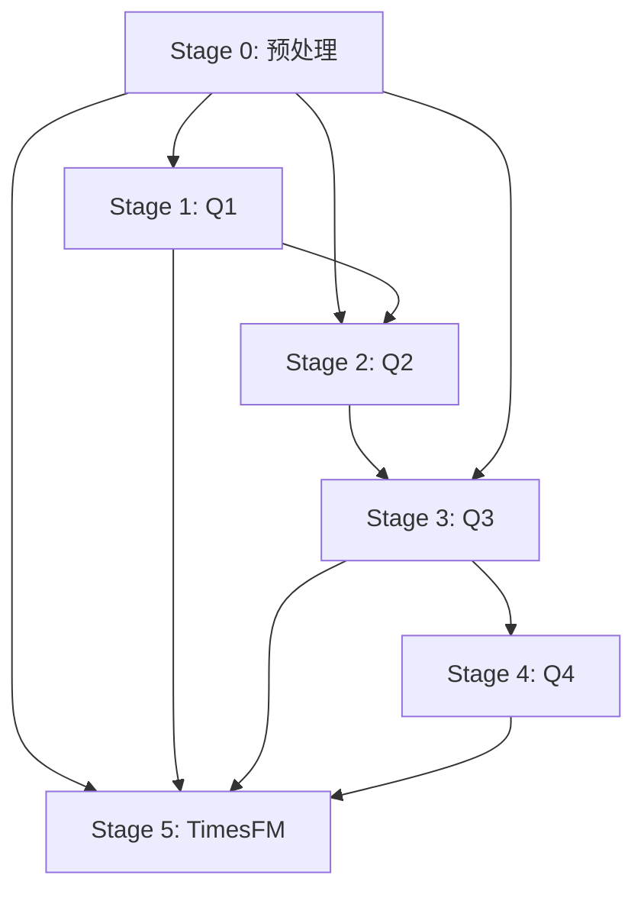

## meta
- status: executing
- current_step: Stage 1+2 完成 → Stage 3
- current_task: Q1双模灰箱 done, Q2双模诊断 done
- last_updated: 2026-07-24 16:30

---

# PLAN.md — B题实施计划

## Stage 0: 数据预处理与特征工程（全题共享）

| # | 任务 | 优先级 | 依赖 | 产出 |
|:---:|------|:---:|------|------|
| 0.1 | 数据清洗：缺失填充、字符串→数值、类型统一 | P0 | 无 | clean_df.pkl |
| 0.2 | L1原始特征 + L2衍生(η,φ,ψ) | P0 | 0.1 | features_L12.npy |
| 0.3 | L3滞后(lag1/3/6) + L4聚合(μ,σ,M,Δ for w=3/6/12) | P0 | 0.2 | features_L34.npy |
| 0.4 | L5交互(Π_load,Γ_alum,Ψ_alum,Ω_night)  | P1 | 0.3 | features_L5.npy |
| 0.5 | Box-Cox/Log1p变换 + TimeSeriesSplit数据集划分 | P0 | 0.4 | X_train, X_val, y_train, y_val |

**DoD**：4380行数据完成清洗，五级特征矩阵可被后续step直接加载

---

## Stage 1: Q1 特征筛选与NTU预测

| # | 任务 | 优先级 | 依赖 | 产出 |
|:---:|------|:---:|------|------|
| 1.0 | XGBoost + SHAP TreeExplainer → 特征重要性 φ_j | P0 | 0.5 | shap_values.pkl, 重要性表 |
| 1.1 | Permutation Importance ×10 → Ĩ_j, I_j^robust = √(φ_j·Ĩ_j) | P0 | 1.0 | robust_importance.csv |
| 1.2 | 三模型集成：XGBoost + LightGBM + RF → 方差加权 | P0 | 1.1 | ensemble_model.pkl |
| 1.3 | SHAP交互效应分析（L5交互特征准入验证） | P1 | 1.2 | shap_interaction.png |
| 1.4 | 2026年2/1, 2/10, 2/20 NTU预测 → Excel输出 | P0 | 1.2 | q1_predictions.xlsx |
| 1.5 | 可视化：SHAP beeswarm + 特征重要性bar + 预测vs实际 | P0 | 1.2 | q1_figures/ |

**DoD**：四模型RMSE/R²对比表，L5交互特征二阶段检验通过，3天预测提交Excel

---

## Stage 2: Q2 FILT.NTU动态时滞建模

| # | 任务 | 优先级 | 依赖 | 产出 |
|:---:|------|:---:|------|------|
| 2.0 | MIC+传递熵时滞估计（R/W NTU, FLOW, ALUM=固定6h） | P0 | 0.5 | tau_params.json ✅ |
| 2.1 | TCN(4层膨胀卷积) + 时滞注意力 + 物理EmbeddedLoss + PINN | P0 | 2.0 | tcn_model.pt ✅ |
| 2.2 | 传递函数/AR(6)/ARMAX(6,4) baseline 对比 | P1 | 0.5 | q2_baseline_comparison.csv ✅ |
| 2.3 | 消融：移除物理Loss / TE→MI / TCN→GRU / 移除注意力 / 无PINN / TE不分段 (迁至step5.0) | P1 | 2.1 | q2_ablation.csv ✅ |
| 2.4 | RMSE/R²评估 + 时滞参数表 + 注意力热力图 | P0 | 2.1 | q2_metrics.csv, q2_figures/ ✅ |

**DoD**：物理Loss效果验证(消融1 vs 完整)，时滞参数表，注意力热力图

---

## Stage 3: Q3 出厂NTU 6-12h混合预测

| # | 任务 | 优先级 | 依赖 | 产出 |
|:---:|------|:---:|------|------|
| 3.0 | 源A：TCN→GRU端到端训练（Huber+λ₁平滑+λ₂上界+λ₃非负） | P0 | 2.0, 0.5 | source_a_model.pt |
| 3.1 | 源B：单变量插槽 → N-BEATS训练 + TimesFM零样本 + Prophet | P0 | 0.5 | source_b_nbeats.pt, source_b_tfm.pkl |
| 3.2 | 40维元特征矩阵构建 + RF元学习器（条件推理） | P0 | 3.0, 3.1 | meta_learner.pkl |
| 3.3 | Sobol全局敏感性分析（Saltelli采样，一阶+总阶效应） | P1 | 3.2 | sensitivity_report.csv |
| 3.4 | 2026年2/1,2/10,2/20 7:00-19:00逐小时预测 → Excel | P0 | 3.2 | q3_predictions.xlsx |
| 3.5 | 消融矩阵：5行全量消融 + TimesFM独立基线对比 | P0 | 3.2 | ablation_q3.csv |
| 3.6 | 可视化：预测曲线+PI区间+敏感度图+RF特征重要性 | P0 | 3.2 | q3_figures/ |

**DoD**：消融矩阵验证B源+RF的增益，Sobol报告，12h预测Excel输出

---

## Stage 4: Q4 水质风险评价

| # | 任务 | 优先级 | 依赖 | 产出 |
|:---:|------|:---:|------|------|
| 4.0 | 三维风险评分：f₁(幅度)+f₂(时长,指数衰减)+f₃(趋势)，熵权法赋权 | P0 | 3.2 | risk_scores.csv |
| 4.1 | Jenks自然断点法四级划分（2025训练集确定断点k₁,k₂,k₃） | P0 | 4.0 | jenks_breaks.json |
| 4.2 | 双重验证：FCE模糊综合 vs Jenks → Kappa一致性 | P0 | 4.1 | kappa_report.json |
| 4.3 | Bootstrap 1000次CI → 等级划分稳定性 | P1 | 4.1 | bootstrap_ci.csv |
| 4.4 | 3月逐日分类明细 + 各等级天数占比 → Excel | P0 | 4.1 | q4_results.xlsx |
| 4.5 | 可视化：风险热力图+状态转移矩阵+等级占比饼图 | P0 | 4.1 | q4_figures/ |

**DoD**：Kappa>0.7，Bootstrap CI稳定，Excel输出完整

---

## Stage 5: 跨题消融与论文支撑

| # | 任务 | 优先级 | 依赖 | 产出 |
|:---:|------|:---:|------|------|
| 5.0 | TimesFM纯零样本独立基线（不参与融合架构） | P0 | 0.5 | timesfm_baseline.csv |
| 5.1 | 全流程消融结果汇总表 + 可视化对比 | P0 | 1.2, 2.3, 3.5, 4.2 | ablation_summary.csv |
| 5.2 | 论文图表打包（300dpi, 统一风格） | P0 | 全部 | paper_figures/ |

**DoD**：消融汇总表，TimesFM基线对比结论

---

## 执行顺序 DAG



**并行机会**：Stage 0完成后，S1和S2和S5可并行。S1完成后S2启动。S2完成后S3启动。

---

## 文件清单

```
Code/
├── PLAN.md                          # 本文件
├── README.md                        # 项目介绍
├── step0_config.py                  # [待实现] 全局配置+物理常数
├── step0_preprocess.py              # [待实现] 数据清洗+L1-L5特征工程
├── step1.0_feature_selection.py     # [待实现] Q1: XGBoost+SHAP
├── step1.1_model_comparison.py      # [待实现] Q1: 三模型集成
├── step1.2_shap_interaction.py      # [待实现] Q1: SHAP交互
├── step1.5_visualization.py         # [待实现] Q1: 图表汇总
├── step2.0_time_delay_estimation.py # [待实现] Q2: MIC+TE时滞
├── step2.1_tcn_dynamic_model.py     # [待实现] Q2: TCN+物理Loss
├── step2.5_visualization.py         # [待实现] Q2: 图表汇总
├── step3.0_source_a_multivariate.py # [待实现] Q3: TCN→GRU源A
├── step3.1_source_b_univariate.py   # [待实现] Q3: N-BEATS/TimesFM源B
├── step3.2_meta_feature_matrix.py   # [待实现] Q3: RF元学习器
├── step3.3_sobol_sensitivity.py     # [待实现] Q3: Sobol敏感性
├── step3.5_visualization.py         # [待实现] Q3: 图表汇总
├── step4.0_risk_scoring.py          # [待实现] Q4: 三维评分+熵权
├── step4.1_jenks_classification.py  # [待实现] Q4: Jenks断点
├── step4.2_dual_validation.py       # [待实现] Q4: FCE+Bootstrap+Kappa
├── step4.5_visualization.py         # [待实现] Q4: 图表汇总
├── step5.0_ablation.py              # [待实现] 跨题汇总消融
├── step5.1_timesfm_baseline.py      # [待实现] TimesFM独立基线
└── docs/
    ├── logs/latest_0.log            # [已完成] 初始日志
    ├── sums/sum_1_题目分析与建模方案.md  # [已完成]
    ├── specs/2026-07-23-architecture-design.md  # [已完成]
    └── migration_prompt.md          # [待完成]
```

---

## 变更记录

| 时间 | 变更 |
|------|------|
| 2026-07-23 21:45 | 初始创建：Stage 0-5任务分解，代码文件清单，执行DAG |
