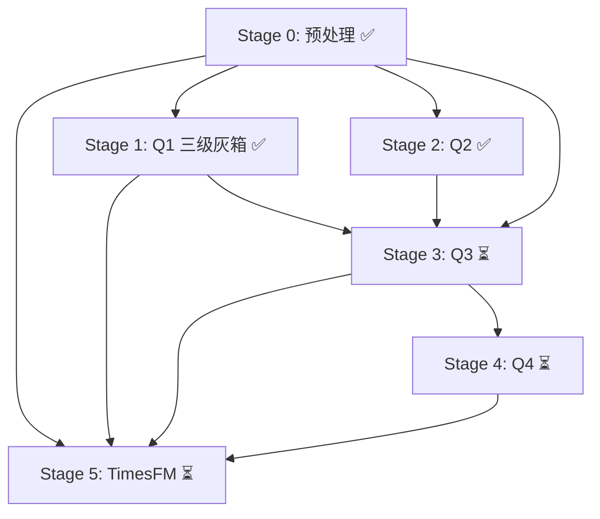

## meta
- status: executing
- current_step: Stage 1 (三级灰箱完成) → Stage 3
- current_task: Q1已闭环(Q2已闭环), Q3准备启动
- last_updated: 2026-07-24 23:00

---

# PLAN.md — B题实施计划

## Stage 0: 数据预处理与特征工程（全题共享）

| # | 任务 | 优先级 | 依赖 | 产出 | 状态 |
|:---:|------|:---:|------|------|:---:|
| 0.1 | 数据清洗：缺失填充、字符串→数值、类型统一 | P0 | 无 | clean_df.pkl | ✅ |
| 0.2 | L1原始特征 + L2衍生(η,φ,ψ) | P0 | 0.1 | features_L12.npy | ✅ |
| 0.3 | L3滞后(lag1/3/6) + L4聚合(μ,σ,M,Δ for w=3/6/12) | P0 | 0.2 | features_L34.npy | ✅ |
| 0.4 | L5交互(Π_load,Γ_alum,Ψ_alum,Ω_night)  | P1 | 0.3 | features_L5.npy | ✅ |
| 0.5 | Box-Cox/Log1p变换 + TimeSeriesSplit数据集划分 | P0 | 0.4 | X_train, X_val, y_train, y_val | ✅ |

**DoD**：4380行数据完成清洗，五级特征矩阵可被后续step直接加载 ✅

---

## Stage 1: Q1 — 三级分层灰箱建模 (CSTR + 经验分区)

**【方法变更】** 原方案(101维XGBoost+SHAP)已替换为三级分层灰箱方案。

### 核心思路

将FILT_NTU按自然分布分为三级，每级独立处理:

| 等级 | 阈值 | 占比 | 策略 | R²(NTU) |
|:---:|---:|---:|---|---:|
| T1 | ≤0.05 | 49.0% | 经验频率采样 | 0.862 (rmse=0.105) |
| T2 | 0.05~0.15 | 30.0% | 对数压缩灰箱 | 0.757 (rmse=0.262) |
| T3 | >0.15 | 21.0% | CSTR+反馈 | 0.668 (rmse=0.664) |
| **全量** | — | 100% | CSTR段2统一 | **0.727** (rmse=0.345) |

### 关键发现

- **CSTR适用于NTU(清水池混合), 不适用于FILT**: NTU(t)=β₂·NTU(t-1)+(1-β₂)·FILT(t), R²=0.727
- **T3应力区核心因素**: η_coag(0.335) > FILT_NTU_mean6(0.242) > TW_FLOW(0.053)
- **τ₁可学习=4h**: softmax加权, 跳过传统统计时滞估计
- **对比原XGBoost**: R²从0.34提升至0.727 (+0.39)

| # | 任务 | 优先级 | 依赖 | 产出 | 状态 |
|:---:|------|:---:|------|------|:---:|
| 1.0 | 三级分类器 (C1+C2两级Logistic) | P0 | 0.5 | tier_params.json | ✅ |
| 1.1 | T1经验频率采样 (JS=0.05优于高斯0.64) | P0 | 1.0 | tier1_report.json | ✅ |
| 1.2 | T2双路径对比 (对数压缩灰箱最优) | P0 | 1.0 | tier2_comparison.json | ✅ |
| 1.3 | T3 CSTR+反馈+τ₁+λ₃扫参 (14组实验) | P0 | 1.0 | tier3_sweep_results.csv | ✅ |
| 1.4 | T3特征重要性 (SHAP+Permutation) | P0 | 1.3 | tier3_factor_importance.csv | ✅ |
| 1.5 | 全量NTU R²=0.727验证 + CV 5折=0.732 | P0 | 1.3 | run_q1_full.py | ✅ |

**DoD**：T1/T2/T3三级各自验证通过，NTU全量R²=0.727，T3应力区R²=0.742，特征重要性(η_coag#1)输出 ✅

---

## Stage 2: Q2 — 双模态阈值诊断 + 两区建模

**【方法变更】** 原方案(4层TCN+注意力+物理Loss)已废弃。当前方案基于双模态阈值诊断。

### 核心思路

FILT_NTU以θ=0.15为界分为舒适区(78%)和应力区(22%)，分区建模。舒适区中所有输入-输出相关性≈0(信号被噪声淹没)，应力区中物理关系显现(FILT→NTU r=0.81)。

### 关键发现

- **CCF/MIC/TE三种统计时滞方法全部失效** — 99%+处理效率掩蔽因果信号
- **AR(6) R²=0.52 > TCN R²=-0.15** — 7参数自回归碾压4层深度学习
- **闭环分解失败** — 操作员策略R²=0.0067, 线性不可表示
- **滞后权重**: RW_FLOW 6h, ALUM 8h, RW_NTU 10h (应力区TCN卷积核分析)

| # | 任务 | 优先级 | 依赖 | 产出 | 状态 |
|:---:|------|:---:|------|------|:---:|
| 2.0 | 双模阈值检测: Jenks/CorrBreak/GMM三法交叉验证 | P0 | 0.5 | theta_params.json | ✅ |
| 2.1 | 应力区小TCN + 滞后权重提取 | P0 | 2.0 | q2_lag_weights.json | ✅ |
| 2.2 | 应力区AR(6)/ARMAX基线对比 | P0 | 0.5 | q2_stress_baseline.csv | ✅ |
| 2.3 | 闭环分解: 操作员策略OLS分解(负面结果) | P1 | 2.0 | q2_operator_policy.json | ✅ |
| 2.4 | 舒适区统计报告 | P1 | 2.0 | q2_comfort_report.json | ✅ |

**DoD**：双模阈值确定(θ=0.15)，滞后权重提取完成，统计方法失效结论记录 ✅

---

## Stage 3: Q3 出厂NTU 6-12h混合预测

| # | 任务 | 优先级 | 依赖 | 产出 | 状态 |
|:---:|------|:---:|------|------|:---:|
| 3.0 | 源A：TCN→GRU端到端训练（Huber+λ₁平滑+λ₂上界+λ₃非负） | P0 | 2.0, 0.5 | source_a_model.pt | ⏳ |
| 3.1 | 源B：单变量插槽 → N-BEATS训练 + TimesFM零样本 + Prophet | P0 | 0.5 | source_b_nbeats.pt | ⏳ |
| 3.2 | 40维元特征矩阵构建 + RF元学习器（条件推理） | P0 | 3.0, 3.1 | meta_learner.pkl | ⏳ |
| 3.3 | Sobol全局敏感性分析（Saltelli采样，一阶+总阶效应） | P1 | 3.2 | sensitivity_report.csv | ⏳ |
| 3.4 | 2026年2/1,2/10,2/20 7:00-19:00逐小时预测 → Excel | P0 | 3.2 | q3_predictions.xlsx | ⏳ |
| 3.5 | 消融矩阵：5行全量消融 + TimesFM独立基线对比 | P0 | 3.2 | ablation_q3.csv | ⏳ |
| 3.6 | 可视化：预测曲线+PI区间+敏感度图+RF特征重要性 | P0 | 3.2 | q3_figures/ | ⏳ |

**DoD**：消融矩阵验证B源+RF的增益，Sobol报告，12h预测Excel输出

---

## Stage 4: Q4 水质风险评价

| # | 任务 | 优先级 | 依赖 | 产出 | 状态 |
|:---:|------|:---:|------|------|:---:|
| 4.0 | 三维风险评分：f₁(幅度)+f₂(时长,指数衰减)+f₃(趋势)，熵权法赋权 | P0 | 3.2 | risk_scores.csv | ⏳ |
| 4.1 | Jenks自然断点法四级划分（2025训练集确定断点k₁,k₂,k₃） | P0 | 4.0 | jenks_breaks.json | ⏳ |
| 4.2 | 双重验证：FCE模糊综合 vs Jenks → Kappa一致性 | P0 | 4.1 | kappa_report.json | ⏳ |
| 4.3 | Bootstrap 1000次CI → 等级划分稳定性 | P1 | 4.1 | bootstrap_ci.csv | ⏳ |
| 4.4 | 3月逐日分类明细 + 各等级天数占比 → Excel | P0 | 4.1 | q4_results.xlsx | ⏳ |
| 4.5 | 可视化：风险热力图+状态转移矩阵+等级占比饼图 | P0 | 4.1 | q4_figures/ | ⏳ |

**DoD**：Kappa>0.7，Bootstrap CI稳定，Excel输出完整

---

## Stage 5: 跨题消融与论文支撑

| # | 任务 | 优先级 | 依赖 | 产出 | 状态 |
|:---:|------|:---:|------|------|:---:|
| 5.0 | TimesFM纯零样本独立基线（不参与融合架构） | P0 | 0.5 | timesfm_baseline.csv | ⏳ |
| 5.1 | 全流程消融结果汇总表 + 可视化对比 | P0 | 1.2, 2.3, 3.5, 4.2 | ablation_summary.csv | ⏳ |
| 5.2 | 论文图表打包（300dpi, 统一风格） | P0 | 全部 | paper_figures/ | ⏳ |

**DoD**：消融汇总表，TimesFM基线对比结论

---

## 执行顺序 DAG



---

## 文件清单

```
Code/
├── PLAN.md                          # 本文件
├── README.md                        # 项目介绍
├── step0_config.py                  # [完成] 全局配置+三级参数
├── step0_preprocess.py              # [完成] 数据清洗+L1-L5特征工程
├── step1.0_tier_classifier.py       # [新建] Q1: 三级分类器
├── step1.1_tier1_noise.py           # [新建] Q1: T1经验采样
├── step1.2_tier2_experiment.py      # [新建] Q1: T2双路径
├── step1.3_tier3_greybox.py         # [新建] Q1: T3 CSTR+反馈
├── step1.4_feature_importance.py    # [新建] Q1: T3特征重要性
├── q1_data_utils.py                 # [新建] Q1: 共享工具函数
├── run_q1_full.py                   # [新建] Q1: 汇总表
├── step2.0_greybox_diagnostic.py     # [完成] Q2: 双模阈值检测
├── step2.1_stress_tcn.py            # [完成] Q2: 应力区TCN
├── step2.1+_closed_loop_decompose.py# [完成] Q2: 闭环分解
├── step2.2_baseline_comparison.py   # [完成] Q2: 应力区基线
├── step2.3_comfort_report.py        # [完成] Q2: 舒适区报告
├── step2.5_visualization.py         # [完成] Q2: 图表汇总
├── step5.0_ablation.py              # [完成] 消融实验
├── step5.1_timesfm_baseline.py      # [待实现] TimesFM基线
├── step3.0_source_a_multivariate.py # [待实现] Q3: 源A
├── step3.1_source_b_univariate.py   # [待实现] Q3: 源B
├── step3.2_meta_feature_matrix.py   # [待实现] Q3: 元特征
├── step3.3_sobol_sensitivity.py     # [待实现] Q3: Sobol
├── step3.5_visualization.py         # [待实现] Q3: 图表
├── step4.0_risk_scoring.py          # [待实现] Q4: 评分
├── step4.1_jenks_classification.py  # [待实现] Q4: 断点
├── step4.2_dual_validation.py       # [待实现] Q4: 验证
├── step4.5_visualization.py         # [待实现] Q4: 图表
└── docs/
    ├── logs/latest_0.log            # [已完成] 初始日志
    ├── logs/latest_1.log            # [已完成] 数据清洗
    ├── logs/latest_2.log            # [已完成] 特征工程
    ├── logs/latest_3.log            # [已完成] Q2开发
    ├── logs/latest_4.log            # [已完成] Q1三级方案
    ├── sums/sum_1_题目分析与建模方案.md  # [已完成]
    ├── sums/sum_2_F_RIDE审查.md        # [已完成]
    ├── sums/sum_3_Q1实验结果.md        # [已完成]
    ├── sums/sum_4_Q2时滞估计.md        # [已完成]
    ├── sums/sum_4b_灰箱重构+双模阈值.md # [已完成] 队友版
    ├── sums/sum_5_Q1三级分层灰箱.md    # [已完成] 当前方案
    ├── specs/2026-07-23-architecture-design.md  # [已完成]
    ├── specs/2026-07-24-Q1三级分层灰箱-design.md # [新建]
    └── migration_prompt.md          # [已完成]
```

---

## 变更记录

| 时间 | 变更 |
|------|------|
| 2026-07-23 21:45 | 初始创建：Stage 0-5任务分解，代码文件清单，执行DAG |
| 2026-07-24 15:30 | Stage1全面重写: 新三级分层灰箱方案替代原XGBoost方案; 新增6个code文件+2个docs文件; PLAN.md状态更新 |
| 2026-07-24 23:00 | Stage1/Stage2全面闭环; Plan文件清单更新; Reference/sums/学习记录补充; Q1架构spec创建 |
