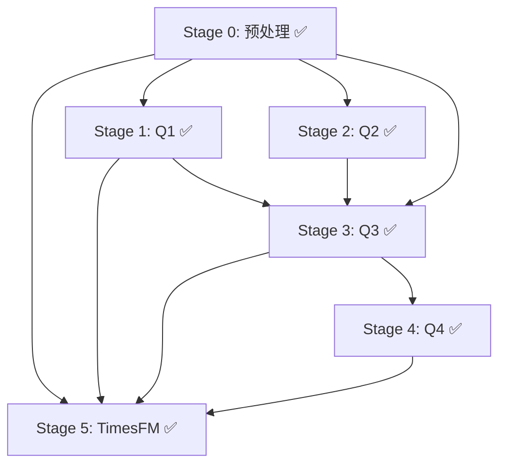

## meta
- status: completed
- current_step: Stage 3 (Q3已闭环) → 论文写作
- current_task: Q1/Q2/Q3/Q4全部闭环, 数字口径已统一 (sum_13), 论文写作进行中
- last_updated: 2026-07-27 14:30

---

# PLAN.md — B题实施计划

## Stage 0: 数据预处理与特征工程（全题共享）

| # | 任务 | 优先级 | 依赖 | 产出 | 状态 |
|:---:|------|:---:|------|------|:---:|
| 0.1 | 数据清洗：缺失填充、字符串→数值、类型统一 | P0 | 无 | clean_df.pkl | ✅ |
| 0.2 | L1原始特征 + L2衍生(η,φ,ψ) | P0 | 0.1 | features_L12.npy | ✅ |
| 0.3 | L3滞后(lag1/3/6) + L4聚合(μ,σ,M,Δ for w=3/6/12) | P0 | 0.2 | features_L34.npy | ✅ |
| 0.4 | L5交互(Π_load,Γ_alum,Ψ_alum,Ω_night)  | P1 | 0.3 | features_L5.npy | ✅ |
| 0.5 | Box-Cox/Log1p变换 + TimeSeriesSplit数据集划分 | P0 | 0.4 | X_train, X_val, y_train, y_val | ✅ |

**DoD**：4380行数据完成清洗，五级特征矩阵可被后续step直接加载 ✅

---

## Stage 1: Q1 — 三级分层灰箱建模 (CSTR + 经验分区)

**【方法变更】** 原方案(101维XGBoost+SHAP)已替换为三级分层灰箱方案。

### 核心思路

将FILT_NTU按自然分布分为三级，每级独立处理:

| 等级 | 阈值 | 占比 | 策略 | R²(NTU) |
|:---:|---:|---:|---|---:|
| T1 | ≤0.05 | 49.0% | 经验频率采样 | 0.862 (rmse=0.105) |
| T2 | 0.05~0.15 | 30.0% | 对数压缩灰箱 | 0.757 (rmse=0.262) |
| T3 | >0.15 | 21.0% | CSTR+反馈+平衡检测器 | 0.788 (rmse=0.546) |
| **全量** | — | 100% | CSTR段2统一 + 分tier A + 平衡检测器 | **0.807** (rmse=0.305) |

> 注: 上表R²基于step1.7_final_cstr.py产出。全量R²=0.807含分tier A (400/250/30) + 平衡检测器 (RL·Q→A=100/20)。

### 关键发现

- **CSTR适用于NTU(清水池混合), 不适用于FILT**: NTU(t)=β₂·NTU(t-1)+(1-β₂)·FILT(t), R²=0.807
- **T3应力区核心因素**: η_coag(0.335) > FILT_NTU_mean6(0.242) > TW_FLOW(0.053)
- **τ₁可学习=4h**: softmax加权, 跳过传统统计时滞估计
- **对比原XGBoost**: R²从0.34提升至0.807 (+0.467)

| # | 任务 | 优先级 | 依赖 | 产出 | 状态 |
|:---:|------|:---:|------|------|:---:|
| 1.0 | 三级分类器 (C1+C2两级Logistic) | P0 | 0.5 | tier_params.json | ✅ |
| 1.1 | T1经验频率采样 (JS=0.05优于高斯0.64) | P0 | 1.0 | tier1_report.json | ✅ |
| 1.2 | T2双路径对比 (对数压缩灰箱最优) | P0 | 1.0 | tier2_comparison.json | ✅ |
| 1.3 | T3 CSTR+反馈+τ₁+λ₃扫参 (14组实验) | P0 | 1.0 | tier3_sweep_results.csv | ✅ |
| 1.4 | T3特征重要性 (SHAP+Permutation) | P0 | 1.3 | tier3_factor_importance.csv | ✅ |
| 1.5 | 全量NTU in-sample R²=0.807验证 + 诚实TS-CV R²=0.737 (sum_13) | P0 | 1.3 | step1.9+ + step1.7+_tscv_validation | ✅ |

**DoD**：T1/T2/T3三级各自验证通过，NTU全量R²=0.807，T3应力区R²=0.788，特征重要性(η_coag#1)输出 ✅

---

## Stage 2: Q2 — 双模态阈值诊断 + 两区建模

**【方法变更】** 原方案(4层TCN+注意力+物理Loss)已废弃。当前方案基于双模态阈值诊断。

### 核心思路

FILT_NTU以θ=0.15为界分为舒适区(78%)和应力区(22%)，分区建模。舒适区中所有输入-输出相关性≈0(信号被噪声淹没)，应力区中物理关系显现(FILT→NTU r=0.81)。

### 关键发现

- **CCF/MIC/TE三种统计时滞方法全部失效** — 99%+处理效率掩蔽因果信号
- **AR(6) R²=0.52 > TCN R²=-0.15** — 7参数自回归碾压4层深度学习
- **最终方案: log(FILT+1e-3) AR(6)+RidgeCV, CV R²=0.696** (step2.5)
- **闭环分解失败** — 操作员策略R²=0.0067, 线性不可表示
- **闭环掩蔽五重证据链** — 统计/物理/学习/诊断/结构 五角度独立验证 (sum_11+Reference sum_10)

| # | 任务 | 优先级 | 依赖 | 产出 | 状态 |
|:---:|------|:---:|------|------|:---:|
| 2.0 | 双模阈值检测: Jenks/CorrBreak/GMM三法交叉验证 | P0 | 0.5 | theta_params.json | ✅ |
| 2.1 | 应力区小TCN + 滞后权重提取 | P0 | 2.0 | q2_lag_weights.json | ✅ |
| 2.2 | 应力区AR(6)/ARMAX基线对比 | P0 | 0.5 | q2_stress_baseline.csv | ✅ |
| 2.3 | 闭环分解: 操作员策略OLS分解(负面结果) | P1 | 2.0 | q2_operator_policy.json | ✅ |
| 2.4 | 舒适区统计报告 | P1 | 2.0 | q2_comfort_report.json | ✅ |

**DoD**：双模阈值确定(θ=0.15)，滞后权重提取完成，统计方法失效结论记录 ✅

---

## Stage 3: Q3 出厂NTU 6-12h混合预测

**【方法变更】** 原方案(双源TCN/GRU+N-BEATS+RF元学习器)已替换为四层条件路由。

### 核心思路

在5:00将每天分为A(稳态)/B(过渡)/C(动态)三类，C型内再按FILT≥1.0分为C_strong/C_weak：

| 天型 | 条件 | 策略 | 参数 |
|---|---|---|---|
| A | FILT<0.05, abs(ΔNTU)<0.02 | NTU(5:00)持久 | 0 |
| B | 其余 | α·CSTR+(1-α)·持久 | α=0.34 |
| C_strong | FILT≥1.0 | CSTR链 | 0 |
| C_weak | FILT [0.15, 1.0) | 持久+γ·(CSTR-持久) | γ=0.25 |

### 关键发现

- CSTR适用阈值 C_th=1.0（非预期0.5），经过全局扫描验证
- γ=0.25 阻尼因子：C_weak区CSTR方向正确但幅度过激
- CSTR链以真NTU(1:00)初始化（已知测量值）
- 最终方案只有2个QL参数+1个阈值（致敬Q1的5参数设计）

| # | 任务 | 优先级 | 依赖 | 产出 | 状态 |
|:---:|------|:---:|------|------|:---:|
| 3.0 | 天型分类器 A/B/C | P0 | 0.5 | day_type_classifier | ✅ |
| 3.1 | CSTR链 (继承Q1参数) | P0 | Q1 | cstr_chain | ✅ |
| 3.2 | 全局参数扫描 α, γ, C_th | P0 | 3.0, 3.1 | fixed_params | ✅ |
| 3.3 | 5-fold CV 验证 (oracle) | P0 | 3.2 | CV R²=0.602 (oracle+偏置) | ✅ |
| 3.3+ | 诚实部署口径: AR(6)预测FILT→CSTR链 | P0 | 3.3 | **forecast R²=0.485, oracle 0.617** (step3.8+) | ✅ |
| 3.4 | 消融矩阵 6行 (RF→集成→分层→Q1式→init→γ阻尼) | P0 | 3.3 | ablation table | ✅ |
| 3.5 | 2026年2/1,2/10,2/20预测 | P0 | 3.2 | 2025同日期proxy (2026月文件仅1天且NTU缺失) | ✅ |
| 3.6 | step3.8_final_stratified.py | P0 | 全部 | 最终代码文件 | ✅ |

**DoD**：oracle CV=0.602 可复现（注: 0.602 为 FILT 真值已知口径），诚实部署 forecast=0.485 可复现 (sum_13)，消融表完整，Q1→Q3方法论迁移验证完毕 ✅

---

## Stage 4: Q4 水质风险评价

**融合Q1/Q2**: 分区归一化(θ=0.15) + 滞后对齐差分(τ) + CSTRβ₂惯性折扣 + η_coag趋势加权

| # | 任务 | 优先级 | 依赖 | 产出 | 状态 |
|:---:|------|:---:|------|------|:---:|
| 4.0 | 三维风险评分：f₁(分区归一化)+f₂(分区T_half+β₂折扣)+f₃(τ对齐+η加权)，熵权法赋权 | P0 | Q2 tau, Q1 β₂ | q4_risk_scores.csv | ✅ |
| 4.1 | 分区独立Jenks (舒适区3级+应力区3级) → 校准映射统一四级 | P0 | 4.0 | q4_final_grades.npy | ✅ |
| 4.2 | 双重验证：FCE vs Jenks → Kappa(分层) + Bootstrap 1000次 + 事件回溯验证 | P0 | 4.1 | kappa_report, event_backtest | ✅ |
| 4.3 | Bootstrap 1000次CI → 等级划分稳定性 | P1 | 4.1 | bootstrap_ci.csv | ✅ |
| 4.4 | 3月逐日分类明细 + 各等级天数占比 → Excel | P0 | 4.1 | q4_results.xlsx | ✅ |
| 4.5 | 可视化：7图(风险热力图+转移矩阵+分区联合+维度贡献+事件混淆+NTU双轴) | P0 | 4.1 | q4_figures/ | ✅ |

**DoD**：Kappa>0.7，Bootstrap CI稳定，Excel输出完整，事件回溯验证通过

---

## Stage 5: 跨题消融与论文支撑

| # | 任务 | 优先级 | 依赖 | 产出 | 状态 |
|:---:|------|:---:|------|------|:---:|
| 5.0 | TimesFM纯零样本独立基线（不参与融合架构） | P0 | 0.5 | timesfm_baseline.csv (mathorcup环境, 均值~0.094失败证毕) | ✅ |
| 5.1 | 全流程消融结果汇总表 + 可视化对比 | P0 | 1.2, 2.3, 3.5, 4.2 | ablation_summary.csv | ✅ |
| 5.2 | 论文图表打包（300dpi, 统一风格） | P0 | 全部 | paper_figures/ | ✅ |

**DoD**：消融汇总表 ✅，TimesFM基线对比结论 ✅ (2026-07-27 sum_13)

---

## 执行顺序 DAG


```mermaid
graph TD
    S0[Stage 0: 预处理 ✅] --> S1[Stage 1: Q1 ✅]
    S0 --> S2[Stage 2: Q2 ✅]
    S0 --> S5[Stage 5: TimesFM ✅]
    S1 --> S3[Stage 3: Q3 ✅]
    S2 --> S3
    S0 --> S3
    S3 --> S4[Stage 4: Q4 ✅]
    S1 --> S5
    S3 --> S5
    S4 --> S5
```

---

## 文件清单

```
Code/
├── PLAN.md                          # 本文件
├── README.md                        # 项目介绍
├── step0_config.py                  # [完成] 全局配置+三级参数
├── step0_preprocess.py              # [完成] 数据预处理+特征工程
├── step1.0_tier_classifier.py       # [完成] Q1: 三级分类器
├── step1.1_tier1_noise.py           # [完成] Q1: T1经验采样
├── step1.2_tier2_experiment.py      # [完成] Q1: T2双路径
├── step1.3_tier3_greybox.py         # [完成] Q1: T3 CSTR+反馈
├── step1.4_feature_importance.py    # [完成] Q1: T3特征重要性
├── step1.5_visualization.py         # [完成] Q1: 可视化
├── step1.6_cstr_refinement.py       # [完成] Q1: A线探索(档案)
├── step1.7_final_cstr.py            # [完成] Q1: 最终公式 R²=0.807
├── step1.7+_cstr_figures.py         # [完成] Q1: 图表
├── step1.8_model_compare.py         # [完成] 模型对比
├── step1.9_physical_reconstruct.py  # [完成] 物理重构(废弃)
├── step1.9+_summary_report.py       # [完成] Q1: 汇总表
├── step1_shared.py                  # [完成] Q1: 共享工具函数
├── step2.0_greybox_diagnostic.py    # [完成] Q2: 双模阈值检测
├── step2.1_stress_tcn.py           # [完成] Q2: 应力区TCN
├── step2.1+_closed_loop_decompose.py# [完成] Q2: 闭环分解
├── step2.2_baseline_comparison.py   # [完成] Q2: 基线对比
├── step2.3_comfort_report.py        # [完成] Q2: 舒适区报告
├── step2.5_logar_final.py           # [完成] Q2: log-AR(6) 终版
├── step2.5_visualization.py         # [完成] Q2: 图表
├── step2.7_generate_figures.py      # [完成] Q2: 图表生成
├── step2_shared.py                  # [完成] Q2: 共享工具
├── step3.8_final_stratified.py      # [完成] Q3: oracle口径 R²=0.602 (FILT真值已知)
├── step3.8+_forecast_cstr.py        # [完成] Q3: 诚实部署口径 forecast R²=0.485 (sum_13)
├── step3.9_diagnostics.py           # [完成] Q3: 路由/损失诊断 (routing最优)
├── step4.0_risk_scoring.py          # [完成] Q4: 风险评分 (前瞻/回顾双模式)
├── step4.1_jenks_classification.py  # [完成] Q4: Jenks断点
├── step4.2_dual_validation.py       # [完成] Q4: 双重验证
├── step4.4_predict_2026.py          # [完成] Q4: 2026预测
├── step4.5_visualization.py         # [完成] Q4: 图表
├── step5.0_ablation.py              # [完成] 消融实验
├── step5.1_timesfm_baseline.py      # [完成] TimesFM基线 (mathorcup环境)
├── step5.2_final_summary.py         # [完成] 终版汇总
├── step5.3_package_figures.py       # [完成] 论文图表
├── step1.7+_tscv_validation.py      # [完成] Q1诚实TS-CV (R²=0.737 @ 6.09/44)
├── results/number_census.csv        # [完成] 论文唯一数字总表 (sum_13)
├── archive/                         # 旧版代码存档
│   ├── step3.0_pipeline_main.py     # Q3 原链式方案
│   ├── step3.1_residual_train.py   # Q3 原残差RF
│   ├── step3.2_forecast_2026.py    # Q3 原预测
│   ├── step3.3_validation.py       # Q3 原CV
│   ├── step3.4_sensitivity.py      # Q3 原Sobol
│   ├── step3.5_visualization.py    # Q3 原图表
│   ├── step3.5+_summary_report.py  # Q3 原汇总
│   ├── step1.10_learnable_beta.py  # FAIL探索: NN可学习β/θ (2026-07-27归档)
│   └── step3.9_learnable_routing.py # FAIL探索: NN路由 (2026-07-27归档)
├── output/                          # 模型产出 (不入git)
├── results/                         # 图表+表格；number_census.csv 论文数字源
├── tests/                           # 守卫 test_core_guards.py (G1-G10, 产物变更必跑)
├── docs/                            # 文档体系
│   ├── logs/latest_0~16.log
│   ├── sums/sum_1~13.md
│   ├── specs/
│   ├── materials/                   # 论文材料区 (01主题素材/02核心文档/03文献库/04亮点档案/05审查总账)
│   ├── 代码手→论文手交接说明.md
│   └── migration_prompt.md
└── Reference/                       # Agent认知重建
```

---

## 变更记录

| 时间 | 变更 |
|------|------|
| 2026-07-23 21:45 | 初始创建：Stage 0-5任务分解，代码文件清单，执行DAG |
| 2026-07-24 15:30 | Stage1全面重写: 新三级分层灰箱方案替代原XGBoost方案 |
| 2026-07-24 23:00 | Stage1/Stage2全面闭环; Q1架构spec创建 |
| 2026-07-26 18:00 | **Q3/Q4闭环**; Stage3全面重写为四层条件路由; Q1 R²更新为0.807; 文件清单更新; DAG全部✅; 清洁旧文件; 文档体系完整 (sum_12+latest_15+Reference sum_11); 项目状态→completed, 转论文写作 |
| 2026-07-27 18:30 | **时期C论文材料六步链完成** (sum_13口径统一 + 守卫10/10 + audit_1收敛 + 文献6卡 + 评审18/18); materials 五类目录 + tests/ 落地; v1迭代清单 + v2草案 (等用户审核); 文件清单更新 |
