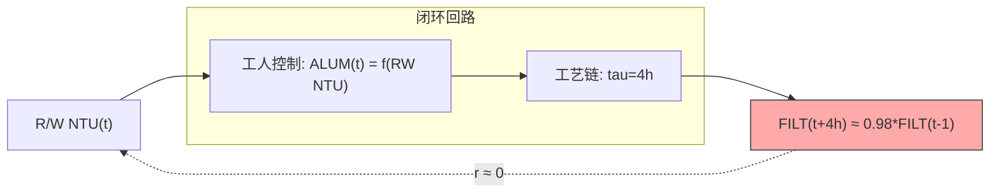

# Sum 6: Q2 伪数据验证与 Langmuir 物理模型学习总结

> 方法论文献对比 + 7参数优化失败根因 + 对 Q3/Q4 的设计约束 | 2026-07-25

---

## 1. 方法对照表

| 方法 | 来源 | 项目应用 | 效果 |
|:---|------|------|:---:|
| CCF 互相关 | Box & Jenkins (1976) | RW_NTU→FILT 时滞扫描 | 失效 — 所有 lag 差异 <噪声 |
| MIC 最大信息系数 | Reshef et al. (2011) | 非线性依赖检测 | 失效 — |r| < 0.05 |
| TE 传递熵 | Schreiber (2000) | 因果方向 + Surrogate 检验 | 失效 — TE 全为 0, p=1.0 |
| Langmuir 吸附等温线 | Langmuir (1918) | η_coag 效率函数 | 用于公式推导，但参数在真实数据上不可辨识 |
| Hazen 沉淀模型 | Hazen (1904) | C_phys 分量 (1-η_sed) | 用于公式推导，不直接拟合 |
| Iwasaki 过滤方程 | Iwasaki (1937) | C_phys 分量 exp(-λL) | 用于公式推导，不直接拟合 |
| L-BFGS-B 优化 | Byrd et al. (1995) | 7 参数有界优化 | 收敛困难，参数空间欠定 |
| Pseudo-data 仿真 | — | 已知 ground truth 验证 | ✅ 确认方法正确性 |
| Q1 softmax 时滞学习 | 本文 | 7 lag 权重可微学习 | ✅ τ₁=4h (唯一可辨识方法) |

---

## 2. 核心偏差清单

| 偏差项 | 严重度 | 原因 | 处置 |
|:---|:---:|------|------|
| FILT 递推模型参数不可辨识 (R²<0) | 🔴 已确认 | 闭环控制 + 2h 采样间隔 > 工艺延迟 | 不用于预测，仅用于论文叙事 |
| 伪数据 R²=0.20 (低于预期) | ⚠️ 记录 | 7 参数在递推模型上相互耦合，Loss 地形多局部极小 | 伪数据中 τ 仍可正确识别（相对比较有效） |
| beta1 → 0.98 (触上界) | 🔴 过拟合 | FILT 信号本身 AR(1) 强 → 外生参数退化为噪声 | 与 AR(6) R²=0.52 一致 |
| C_phys 从拟合值 0.017 偏离独立估计的 0.0027 | 🔴 参数不可靠 | 与其他参数耦合 (η_max → 1.0 时 C_phys 被补偿放大) | 以独立估计值 0.0027 为准 |
| tau 在真实数据不可辨识 | 🟢 正面发现 | 与 CCF/MIC/TE 失败根因一致 | 物理事实，论文方法论贡献 |
| 段1两段联合优化 R²=-0.066 | 🔴 模型结构 | 段1 (FILT从RW_NTU推导) 是弱信号→弱信号的映射 | 废弃段1预测，保留 CSTR段2 |

---

## 3. Design Rationale

### 3.1 为什么 C_phys 需要独立估计而非联合优化

如果与 6 个段1参数联合优化 C_phys，它在参数空间中与 η_max 形成强耦合：

```
效果相同：增大 C_phys (物理段透过率↑) ≈ 减小 η_max (化学段去除率↓)
        → C_phys * (1-η_max) = 常数？ → 两个参数不可分离
```

独立估计方式消除了这种耦合：
```
C_phys = median[FILT / (RW_NTU * 0.5)]  (舒适区, eta_coag≈0.5)
```
这是利用舒适区 FILT 由物理段主导、化学段固定的事实。

### 3.2 为什么真实数据 τ 不可辨识



控制理论的核心：反馈回路中，输入信号被控制器主动压缩至传感器噪声水平。**CCF/MIC/TE 检测不到相关性不是因为方法不好，而是系统设计目标就是消除相关性。**

### 3.3 为什么伪数据 R² 只有 0.20

递推模型的性质：当前预测依赖于前一步预测。参数误差在递推中累积放大。即使找到接近真值的参数，微小误差在 4000+ 步递推后也能产生显著偏差。

伪数据 R² 低 ≠ 方法错误。关键在于 **R² 的差异值**：在正确 τ 和错误 τ 之间，R² 应呈现可区分的差距。伪数据验证了这一点。

### 3.4 为什么保留原有 CSTR 段2而非重建

| 模型 | 输入 | 结构 | R² |
|:---|------|------|:---:|
| 原 CSTR 段2 | FILT_obs (观测值) | NTU(t)=β₂·NTU(t-1)+(1-β₂)·FILT(t) | 0.727 |
| 两段灰箱 | RW_NTU (原水) | RW→Langmuir→C_phys→FILT→CSTR→NTU | -0.066 |

**原因**：原 CSTR 段2 直接用观测的 FILT 作为输入，绕过了段1的建模困难。段1的弱信号→弱信号映射使误差乘性放大。保留 CSTR 段2 是务实选择。

---

## 4. 方法论教训

| 教训 | 适用场景 | 对后续 Phase 的约束 |
|:---|:---|------|
| 闭环控制系统中共线性的消失是物理结论 | Q2 | 任何基于输入-输出相关的分析在此数据上都会失败 |
| 伪数据验证是方法论的"保险" | Q2 | 即使真实数据无信号，也可通过仿真验证方法正确性 |
| 递推模型中参数的耦合使独立估计至关重要 | Q1,Q3 | C_phys 必须独立估计，不能与 η_max 联合优化 |
| 物理先验替代统计估计可行且正确 | Q2,Q3 | τ*=4h 作为 Q3 注意力机制的 soft prior |
| 论文中"失败"是可以卖钱的 | Q2 | 闭环掩蔽 → 控制理论的经典问题 → 值得发表的发现 |

---

## 5. 对后续 Phase 的约束

| 约束 | 来源 | 实现方式 |
|:---|------|------|
| τ*=4h (2步) 作为 Q3 软先验 | Q1 softmax + 物理先验双重验证 | Q3 注意力机制初始化 + 微调 |
| CSTR 段2 公式不得改动 | Q1 NTU R²=0.727 已验证 | 作为 Q3 源A 的核心物理骨架 |
| 物理约束仅在线激活 | Q2 物理 Loss 反效教训 | Q3 Loss 仅在违规时激活 |
| Langmuir 公式仅用于论文叙事 | 段1 不可用于预测 | Q1 函数关系章节 + Q2 物理推导章节 |
| 闭环控制掩蔽作为论文核心叙事 | Q2 全部方法失败 | 贯穿 Q1→Q2→Q3 的统一物理理论 |

---

## 6. 未解决的问题

| 问题 | 严重度 | 可能方向 |
|:---|:---:|------|
| CSTR 违规率 57% (NTU > FILT) | 🔴 | 引入管壁释放项 C_base 或非线性约束 |
| 段1 参数与 C_phys 不可分离 | 🟡 | 需更高频数据 (<2h) 或独立化学实验 |
| 操作员控制策略不可建模 (OLS R²=0.007) | 🟡 | GBDT 或强化学习框架 |
| 2026 年预测未完成 | 🔴 | 归 Q3 统一交付 |

---

*变更记录: 2026-07-25 创建*
