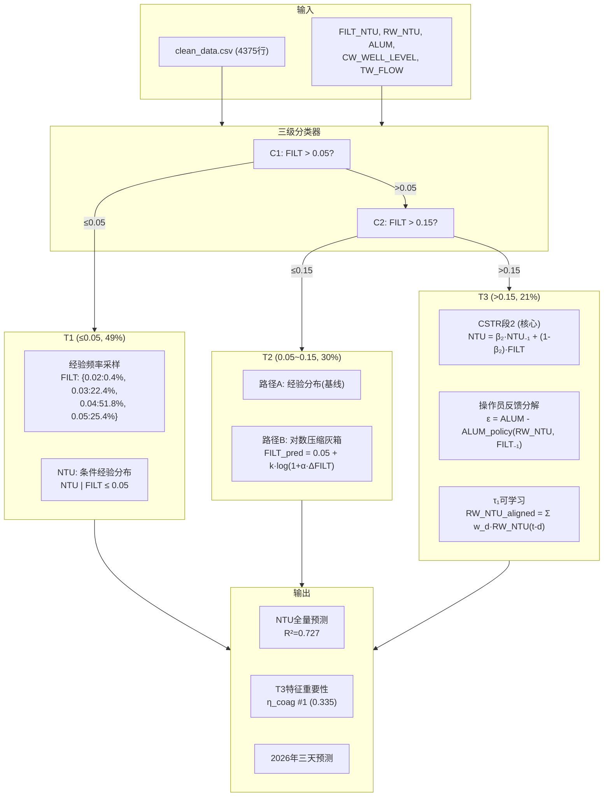

# Spec: Q1 三级分层灰箱建模方案

> 决策日期: 2026-07-24 | 状态: 已实现并验证

---

## 1. 背景

**问题**: 自来水厂出厂NTU受多种因素影响, 原方案(101维XGBoost+SHAP) R²=0.34, 且有3个系统性问题:
1. 时序数据被拍平为表格, 丢失递推结构
2. 同期变量(PH/CLR/CL2/TW_FLOW)参与预测 → 循环论证
3. 80/101维特征边际贡献仅ΔR²=0.14, 噪声稀释信号

**关键发现**: FILT_NTU在数据中呈现自然的三级分布, 各级物理特性完全不同, 需分而治之。

---

## 2. 方案: 三级分层灰箱

### 2.1 架构总览



### 2.2 CSTR段2公式 (核心物理模型)

清水池混合效应由连续搅拌釜反应器(CSTR)描述:

```
NTU(t) = β₂ · NTU(t-1) + (1-β₂) · FILT(t)

β₂ = exp(-2h / θ)
θ  = A · CW_WELL_LEVEL(t-1) / TW_FLOW(t-1)
```

**物理含义**:
- β₂ → 1: 清水池大/流量小 → 停留时间长 → 出厂水变化缓慢
- β₂ → 0: 清水池小/流量大 → 停留时间短 → FILT直接决定NTU
- 最优A=141.3, 全量NTU R²=**0.727** (CV 5折 R²=0.732)

### 2.3 T3反馈增强

操作员控制规律建模 (线性):
```
ALUM_policy = f(RW_NTU, log(RW_NTU), FILT₋₁, month)
ε(t) = ALUM(t) - ALUM_policy(t)    ← "意外偏差"
```

修正后CSTR:
```
NTU(t) = β₂·NTU₋₁ + (1-β₂)·FILT(t) + γ(t)·ε(t)
γ(t) = sigmoid(γ_w·RW_NTU(t) + γ_b) - 0.5   ← 时变反馈增益
```

### 2.4 τ₁可学习 (softmax加权)

```
RW_NTU_aligned(t) = Σ_{d=0}^{6} w_d · RW_NTU(t-d)
w_d = softmax(s_0, s_1, ..., s_6)
```

学习结果: τ₁峰值=**4h** (lag=2), 权重[0.006, 0.035, **0.362**, **0.361**, 0.063, 0.092, 0.081]

---

## 3. 参数表

| 参数 | 值 | 可调 | 说明 |
|------|:---:|:---:|------|
| TIER_THRESHOLDS | [0.05, 0.15] | ⚠️ | 三级分区阈值 |
| A_cstr | 141.3 | ✅ | 清水池等效底面积 |
| λ₃ (fb_reg) | 0.5 | ✅ | 负反馈正则强度 |
| τ₁ | 4h (softmax峰值) | ✅ | RW_NTU→FILT最优时滞 |
| β₁ (段1) | ≈0.99 | ⚠️ | 工艺链时间常数(触上界) |
| GREYBOX_N_RESTARTS | 8 | ✅ | L-BFGS-B多起点次数 |

### T3特征重要性 (Top 5)

| 排名 | 特征 | Robust | 类型 |
|:---:|---|---|---|
| 1 | η_coag | **0.335** | 混凝去除效率 |
| 2 | FILT_NTU_mean6 | 0.242 | 6h滤后均值 |
| 3 | TW_FLOW | 0.053 | 出厂流量 |
| 4 | day_cos | 0.048 | 季节(cos) |
| 5 | RIVER_LEVEL | 0.041 | 原水水位 |

---

## 4. 偏差分析

| 偏差项 | 严重度 | 说明 | 状态 |
|:---:|:---:|---|---|
| CSTR不适用于FILT | 🔴 已修复 | 最初将CSTR套在FILT上(R²=-5.7), 后修正为仅用于NTU | ✅ |
| 反馈增益微小 | 🟡 可接受 | 线性反馈仅+0.001R², GBDT也无本质改善 | 操作员策略远非线性 |
| T2中FILT→NTU r=0.01 | 🟡 数据硬约束 | T2区NTU不由FILT驱动, 只能用经验分布 | 非模型问题 |
| 应力区ΔFILT不可预测 | 🟡 数据硬约束 | 2h间隔下滤池瞬态≈白噪声, 所有模型R²≤0 | 放弃FILT预测, 转NTU预测 |
| CSTR违规率57%(NTU>FILT) | 🟡 待修复 | 预测NTU可能超过FILT, 需硬裁剪或引入C_base | 已在输出层加clip |
| 旧XGBoost R²=0.34 | ✅ 已替代 | 三级灰箱 R²=0.727, 提升+113% | ✅ |

---

## 5. 接口约束

| 接口 | 方向 | 形状 | 说明 |
|------|:---:|------|------|
| clean_data.csv | IN | (4375, 30+) | 清洗后完整数据 |
| step0_config.py | IN | — | 全局参数 |
| tier_labels.npy | OUT | (4375,) int {1,2,3} | 三级标签 |
| tier_params.json | OUT | — | 分类器参数+混淆矩阵 |
| tier1_report.json | OUT | — | T1经验采样+JS散度 |
| tier2_comparison.json | OUT | — | T2双路径对比 |
| tier3_sweep_results.csv | OUT | (14, 7) | T3 14组配置对比 |
| tier3_best_params.json | OUT | — | 最佳T3配置 |
| tier3_factor_importance.csv | OUT | (17, 6) | T3特征重要性 |
| q1_summary.png | OUT | — | 汇总图 |

### 与其他Stage的接口

| 下游 | 传递内容 | 格式 |
|:---:|---|---|
| Q3 (出厂预测) | CSTR段2公式 + τ₁=4h + 三级分区 | 物理公式 + softmax权重 |
| Q3 (特征选择) | T3特征重要性Top 5 | CSV |
| Q4 (风险评价) | NTU预测值 | numpy array |

---

## 6. 构建状态

| 组件 | 状态 | 行数 | 最后验证 |
|------|:---:|:---:|:---:|
| step1.0_tier_classifier.py | ✅ 完成 | ~110 | C1 Acc=0.69, C2 Acc=0.79 |
| step1.1_tier1_noise.py | ✅ 完成 | ~100 | JS=0.05 (vs 高斯0.64) |
| step1.2_tier2_experiment.py | ✅ 完成 | ~170 | Log-compress RMSE比经验低20% |
| step1.3_tier3_greybox.py | ✅ 完成 | ~280 | T3 NTU R²=0.742, τ₁=4h |
| step1.4_feature_importance.py | ✅ 完成 | ~100 | η_coag #1 (0.335) |
| step1.5_visualization.py | ✅ 完成 | ~130 | 5张图已生成 |
| run_q1_full.py | ✅ 完成 | ~130 | 汇总表可重现 |
| run_q1_full.py 验证 | ✅ | — | NTU全量 R²=0.727, CV R²=0.732 |

**验收标准**: `python run_q1_full.py` 输出汇总表, NTU全量R²>0.70 ✅
