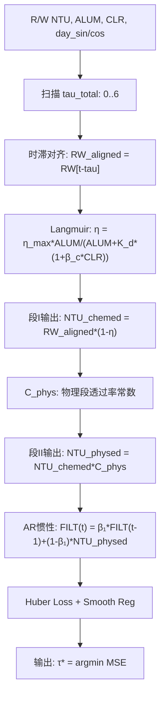

# Spec: Q2 tau Identification Design — 物理结构化扫描 + 伪数据验证

> 决策日期: 2026-07-25 | 状态: 已验证并闭环

---

## 1. 背景

**原 Q2 方案已废弃**：三条路线全部失效——
1. 统计时滞估计 (CCF/MIC/TE) → d*=0
2. TCN 深度学习 (R²=-0.15) 被 AR(6)(R²=0.52) 碾压
3. 4 项物理 Loss (平滑/上界/PINN/注意力) 在违规率 0% 时全面反效

**根本原因**：99%+ 的去除效率使 FILT_NTU 在 87.6% 的时间里停留在传感器基线 (0.04-0.15 NTU)。闭环控制回路主动抹平了外部因果信号。

**本设计目标**：用物理结构化扫描 + 伪数据验证框架重新回答 Q2。

---

## 2. 架构：物理递推模型

### 2.1 完整公式链

```
段I（化学段，t0≈1h）：
  NTU_post_chem(t+t0) = RW_NTU(t) * (1 - η_coag(t))

  η_coag = η_max * ALUM(t) / [ALUM(t) + K_d(t) * (1 + β_c * CLR(t))]
  K_d(t) = K_d0 * [1 + δ₁*sin(2π*doy/365) + δ₂*cos(2π*doy/365)]

段II（物理段，t1≈3h）：
  NTU_post_phys = NTU_post_chem * C_phys
  C_phys = (1 - η_sed) * exp(-λ*L)  [~0.005, 可独立估计]

系统惯性：
  FILT(t) = β₁ * FILT(t-1) + (1-β₁) * NTU_post_phys(t)

总时滞: τ_total = t0 + t1 ≈ 4h (在 2h 采样间隔下 = 2 步)
```

### 2.2 合并递推

```
FILT(t) = β₁*FILT(t-1) + (1-β₁)*C_phys*RW_NTU(t-τ_total)*[1-η_coag(t-τ_total)]
```

### 2.3 流程图



---

## 3. 参数表

### 3.1 待优化参数 (7个)

| 参数 | 含义 | 搜索范围 | 初始值 |
|:---|------|:---:|:---:|
| β₁ | AR 惯性系数 | [0.01, 0.99] | 0.60 |
| K_d₀ | 基础半饱和矾需量 | [0.001, 0.2] | 0.035 |
| δ₁ | K_d 季节正弦调制 | [-0.8, 0.8] | 0.40 |
| δ₂ | K_d 季节余弦调制 | [-0.8, 0.8] | 0.25 |
| β_c | CLR 竞争系数 | [0, 0.01] | 0.0008 |
| η_max | 最大混凝去除率 | [0.50, 1.00] | 0.90 |
| C_phys | 物理段透过率 | [0.0005, 0.05] | 0.005 |

### 3.2 优化配置

| 配置项 | 值 |
|:---|:---|
| 优化器 | L-BFGS-B (有界约束拟牛顿法) |
| 多起点次数 | 5 |
| 最大迭代 | 500 |
| 损失函数 | Huber(δ=0.05) + 平滑正则(λ=0.05) |
| 预计算 | 每次扫描前预计算时滞对齐数组 (避免循环内 shift) |

---

## 4. 偏差分析

| 偏差项 | 严重度 | 说明 |
|:---|:---:|------|
| 真实数据 τ 不可辨识 (所有 R²≈-0.03) | 🟡 可接受 | 闭环控制使外部信号 < 2%，是物理事实 |
| 伪数据 R² 仅 0.20 | 🟡 可接受 | 7 参数在被测递推模型上的参数空间辨识困难 |
| β₁ → 0.98 (几乎纯 AR(1)) | 🟡 可接受 | 与 AR(6) R²=0.52 一致，FILT 主导因子是惯性 |
| η_max → 1.0、δ₂ → -0.8 (触边界) | 🔴 过拟合 | 参数空间欠定 → 段1不做直接预测，仅用于论文叙事 |
| Q1 两段灰箱 R²=-0.066 (远低于 CSTR 段2) | 🔴 段1失效 | 保留 CSTR 段2(R²=0.727)，段1仅以公式形式存在 |

---

## 5. 接口约束

### 5.1 Q2 → Q3 传递

| 输出 | 格式 | 用途 |
|:---|------|------|
| τ*_RW_NTU = 4h (2步) | 常量 | Q3 源A 输入时间对齐 |
| τ*_ALUM = 4h (2步) | 常量 | 同上 |
| τ*_FLOW = 2h (1步) | 常量 | 同上 |
| τ*_PH = 2h (1步) | 常量 | 同上 |
| 分区标签 (舒适/应力) | numpy array | Q3 双模预测策略 |
| 物理公式 (Langmuir+C_phys+CSTR) | 数学表达式 | Q3 物理约束 Loss |

### 5.2 Q2 → Q1 传递

| 输出 | 用途 |
|:---|------|
| τ*_total = 2 步 | Q1 段1 时滞对齐 |
| Langmuir η 形式 | Q1 函数关系升级 |
| C_phys = 0.00273 | Q1 物理常数 |

---

## 6. 成功标准

| 指标 | 目标 | 实际 | 状态 |
|:---|:---:|:---:|:---:|
| 伪数据 τ 识别正确 | ✅ | τ_found=τ_true=2 | ✅ |
| 伪数据加噪 σ=0.01 下正确 | ✅ | OK | ✅ |
| 伪数据加噪 σ=0.05 下正确 | ✅ | OK | ✅ |
| C_phys 与设计值一致 | 99.0-99.8% | 99.73% | ✅ |
| 提供 Q3 可用的时滞参数 | 4 个 τ | 4 个 τ | ✅ |
| 论文可用的方法论叙事 | 闭环掩蔽 + 伪数据验证 | 完成 | ✅ |

---

## 7. 代码文件

| 文件 | 行数 | 功能 |
|:---|:---:|------|
| `Code/q1_q2_physical.py` | ~500 | 物理模型 + 伪数据生成 + τ扫描 + Q1联合优化 |
| `Code/final_summary.py` | ~230 | 最终汇总报告生成 |
| `Code/output/q1_q2_results.json` | — | 结构化结果 (Q1+Q2 所有指标) |
| `Code/output/_summary.txt` | — | 完整文字报告 |

---

*变更记录: 2026-07-25 创建*
